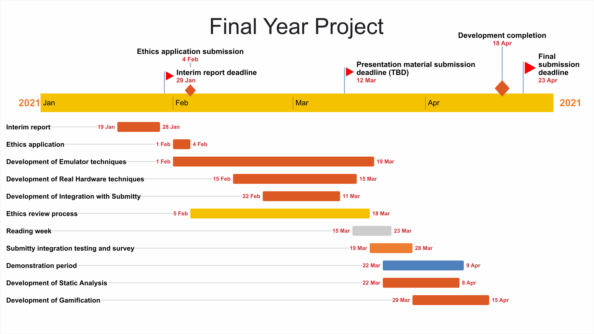

# Background

Automated grading of programming assignments is a desirable option to have in
the face of growing class sizes. Considering the nature of the assignments,
marking seems like an obvious target for automation. Platforms like the
open-source Submitty have been developed to fulfill this idea [@submitty].

However, the
focus when grading is almost always on functional or "black box" testing. In
this model, the student's code is given a set of inputs, and the produced
outputs are tested against a corresponding pre-determined set of correct ones [@online_judge].
This is usually as simple as passing a list of items as command line arguments
or strings on standard input and parsing the results from standard output.
Usually an additional set of "hidden test cases" (inputs which the student can
never obtain direct access to) is used to prevent hardcoding of answers.

Aside from preventing the use of hardcoded outputs (and possibly measuring how
long it took for a student's code to execute, usually to detect infinite loops),
the quality of a submission is never tested. While this is less important for
some types of assignments (implementation of some algorithm in a high-level
language), marks for topics like high-performance assembly programming are often
given for specific instructions and optimisations used.

In order to more appropriately grade assignments in such topics, more
in-depth analysis is required. This project seeks to explore the potential of
runtime performance measurement techniques in grading ARM assembly programs. In
particular, this includes extracting accurate information from running code such
as processor cycles used and presenting this to students.

Hardware such as the Cortex-M series of microcontrollers usually provide
dedicated debugging facilities which allow access to this information [@armv7m]. While
accurate, use of such hardware is not as convenient as testing execution of code
in an emulator running on an off-the-shelf x86_64 machine. This project
therefore also seeks to explore the feasibility of obtaining accurate metrics
from an emulator, comparing this to similar data from dedicated hardware.

\newpage

# Work plan

The main focus of the project is on development of techniques for automated
grading of assignments by measuring performance of code executed in an emulator.
This is reflected in the duration allocated for this task above. Reasonably
complete autograding using a microcontroller to execute code is also
desirable (Real Hardware techniques).

A key component of the project is testing the techniques developed with real
programs. Before this can be achieved, the emulation-based
measurement tooling would need to be integrated with Submitty, the platform
already in use for grading of students' ARM code. Once integration is developed,
a separate instance of Submitty will be used to test code, including some
anonymously submitted student code.

During
this test period, students will have the opportunity to complete a survey on
the value of the automated grading. Ethical approval is required to involve
students in the testing and survey, and this process is lengthy (as shown).
As a result, it is important the application be submitted as soon as possible.

Once these primary targets for the project are completed, additional grading
techniques such as static analysis, along with some kind of "gamification" to
increase user engagement, would improve the project. Since these are not
critical, tasks for these have been left until the end of development.

\newpage

# Ethics review

Broadly speaking, there are relatively few ethical issues with this project.
The automated grading system to be developed is dependent solely on the user's
code and mostly the compiled output (any static analysis would also only
ever want to consider actual instructions for measuring performance, i.e. no
user-written comments). Any code to be automatically graded would not require
any user data such as name, gender or race. Inherently the system would raise
fewer issues than a manual human grader. The system also has no basis in
machine learning, which requires a sample dataset from human graders, inheriting
biases.

An element of the project that requires ethical approval is the participation
of students in testing the system. Once the system is developed, and approval
is obtained, the system will be deployed for students to voluntarily submit
their ARM assembly programs (from the CSU11022 Introduction to Computing module)
for testing. Importantly:

- Both submissions and the survey are entirely voluntary
- Students will make submissions only of previously completed (and already
  graded) assignments
- Submissions will be completely anonymous (code only, no name or email)
- Anonymous grading results will only be available to the researcher (not the
  lecturer of the module)
- System is completely independent of already existing "black box" grading
  system used for the module
- Survey would additionally be completely anonymous, with only a selection of
  "Strongly Disagree" to "Strongly Agree" responses

\newpage

# Literature review

A relatively significant body of published research in automated grading
exists. An early example demonstrating use of a simple system to aid marking of
computer science assignments is given ‘On automated grading of programming
assignments in an academic institution’ [@online_judge]. Cheang _et al_'s
system, dubbed "The Online Judge", was implemented in 1999 to aid a third year
programming course at the National University of Singapore.

The Online Judge was a classic example of so-called "black box" grading. As
described by Cheang _et al_, students' code would be run against sample inputs
which would be compared to known good outputs. A verdict issued to students
would state which test cases passed and failed. The only "dynamic" element in
the testing process was an additional failure state if the code exceeded a
pre-determined execution time or memory limit.

Despite the limited scope, The Online Judge was said to be "invaluable in the
conducting of the CS3233 course", a module preparing students for a programming
competition. The Online Judge was later modified for use in a first year
data structures and algorithms module. The use of even the most rudimentary
systems is clearly a significant aid to grading.

'Submitty: An Open Source, Highly-Configurable Platform for Grading of
Programming Assignments' [@submitty] presents a more modern automated grading
platform. Initially released in 2014 [@submitty_initial_release], Submitty
provides an open-source, self-hostable platform for students to submit code
(in a variety of formats) and an automated grading system with support for many
programming languages (e.g. Python, C/C++, Java, etc.), along with many other
supplementary features [@submitty_features].

Submitty, while making use of a user interface much more in line with those
expected of a 2010's software product, is still mostly designed for use with
functional autograding. However, due to it being an open and extensible
platform, especially on account of its pluggable configurable assignment syntax,
can (and has been) extended to support more advanced automated grading
techniques, such as the use of static analysis, memory debugging and code
coverage tools [@submitty].

\newpage

# References
