# Introduction

## Motivation

Automated grading of programming assignments is a desirable option to have,
allowing instructors and teaching assistants to save a significant amount of
time. Since programming assignments are often based
upon the implementation of a solution to a single relatively specific problem, they
seem like a fairly obvious candidate for automation.

The focus when performing automated
grading is almost always on functional or "black box" testing. In
this model, a student's code is given a set of inputs, and the produced outputs
are tested against a corresponding pre-determined set of correct ones [@online_judge].
This is usually as simple as passing a list of items as command line arguments
or strings on standard input and parsing the results from standard output.
Often, an additional set of "hidden test cases" (inputs which the student can
never obtain direct access to) is used to prevent hardcoding of answers
[@online_judge].

Aside from checking for hardcoded outputs, the quality of a submission is
rarely tested. "Quality" in this context refers to aspects of the code beyond
whether or not it produces correct results, such as maintainability or
performance. While this is less important for
some types of assignments (perhaps implementation of an algorithm in a high-level
language), marks for topics like high-performance assembly programming are
often given for specific instructions and optimisations used.

In order to appropriately grade assignments in such topics, more
in-depth analysis is required. Usually this comes in the form of a manual marking
step. Here, a grader might review a student's submission and identify
specific issues, such as the use of extraneous statements or poor overall
program structure.

The mechanism through which this analysis might be automated is much less
obvious, but any reduction in the requirement for manual grading would be very
beneficial.

In addition to the benefits for instructors, students can also take advantage of
an automated grading system. With manual grading, there is a significant delay
between submission and receiving feedback for an assignment. Since
an automated system can perform its grading in a matter of minutes or seconds,
learning is more efficient. It has been shown that students can even
be more willing to put more time and consideration into their work before final
submission with the aid of immediate feedback [@instant_feedback].

## Context

Introduction to Computing (parts I and II) is taught to first year computer
science students in order to introduce them to fundamental concepts in
computers. Topics include the manner in which CPU executes programs,
representing information in binary form and showing the relationship between
high-level programming concepts and machine instructions [@intro_computing].

This project will explore automated grading within the specific context of these
modules. The advantage of this approach is the availability of a large set of
sample programs to test, along with a class of students that could potentially
evaluate an improved automated grading system. Both modules already make use of
functional automated grading, making use of Submitty, a free and open-source
automated grading platform.

Since ARM assembly programming is the primary driver of learning in Introduction
to Computing, assignments written in ARM assembly will be the target of the
project.

## Goals

The goal of this project is to develop an automated grading system which focuses
specifically on measuring performance (at runtime) of programs. As
previously mentioned, there are a number of potential aspects for
improving automation around programming assignment grading. By choosing a
specific type of assignment and domain for improvement, a more in-depth system
can be realised.

Since the type of assignments being analysed will be relatively short,
hand-written ARM assembly language programs, it makes sense to look at
performance. This is primarily due to the fact that assembly language programs
are usually written with high-performance in mind. Additionally, other aspects
of a program's
grading (aside from correctness) such as maintainability are somewhat more
difficult to anaylse, given that assembly programs have very little structure.
Dynamic or runtime performance analysis is also used over static analysis for
the same reason.

Performance is also not trivial to analyse, as the performance of a program is
not as simple as running a stopwatch until a program finishes. Factors such as
the platform used and interference from other programs can have an impact on
such a measurement, for a start. It can also be difficult to compare two
programs solely based on their run time, even if perfectly accurate. A program
that runs twice as slowly as another might not be twice as poorly written.

The final product should be able to facilitate grading assignments in
Introduction to Computing. This will include testing against specific
assignments given in the modules. In order to work in the real world, the system
will also need to integrate with Submitty. It's worth
noting that the Introduction to Computing modules focus on writing programs to
run on a microcontroller. At time of writing, this is specifically an
STMicroelectronics STM32F4xx-based board (featuring an ARM Cortex-M4 core).
This project will target the same platform.

## Methodology

The overall strategy to develop the best final system is to break down each
high-level component in the system into smaller pieces and find the best
solution to each of the more manageable chunks. One of the most obvious examples
of this in the context of this project is the method of program evaluation.

Broken out of the overall automated grading system, this part will be concerned
with the actual execution of submissions, collecting metrics along the way. It's
not immediately obvious which of a number of potential methods will prove to be
the best for the project. A combination or ability to choose between a number of
different options might be the ultimate answer.

# Background

## Prior work

Automated grading is not a new concept, and there is a relatively significant
body of published work on the topic.

### The Online Judge

The Online Judge was an automated grading system initially used in 1999 for a
third year programming course at the
School of Computing in the National University of Singapore [@online_judge].
A classic example of so-called "black box" grading is presented. As
described by Cheang _et al_, students' code would be run against sample inputs
which would be compared to known good outputs. A verdict issued to students
would state which test cases passed and failed. The only "dynamic" element in
the testing process was an additional failure state if the code exceeded a
pre-determined execution time or memory limit.

Despite the limited scope, The Online Judge was said to be "invaluable in the
conducting of the CS3233 course", a module preparing students for a programming
competition. The Online Judge was later modified for use in a first year
data structures and algorithms module. The use of even the most rudimentary
systems is clearly a significant aid to grading.

### Comparison of automated grading strategies

A number strategies for automated grading of assignments have been explored and
compared. However, most of these strategies are simply variations of functional
or black box approaches. Simple output comparison, more complex output analysis,
unit testing and reflection (where applicable) have all been compared in their
effectiveness. Automating grading using other techniques might only be mentioned
in passing or implemented in a limited manner, such as checking formatting and
for elements such as comments [@testing_strategies].

### EmbedInsight

EmbedInsight was created to automate embedded systems courses, including
Massively Open Online Courses (MOOCs). The key goal of this system is to
test complex assignments that make use of real-world hardware while aiming
to scale out to courses with potentially thousands of participants
[@embedinsight]. There is little exploration of advanced submission analysis.
In fact, the term "black box" is explicitly mentioned as a benefit of the
system, allowing EmbeddedInsight to "support different types of hardware and
software tools without modifying student programs".

Li _et al_ evaluate student submissions in hardware, making use of two separate
microcontroller boards. One runs the student's code (the "Device Under Test" or
DUT), while another is used to check any physical outputs ("Hardware Engine").
The example given is a PWM (Pulse Width Modulation) assignment, where the
hardware engine checks the signal generated by the DUT.
Interestingly, the system makes use of very similar hardware to that of
Introduction to Computing, with an STM32F7-based board for the DUT and an
STM32F4 Discovery board (identical to that used in Introduction to Computing) as
the hardware engine.

### Submitty

Submitty presents a more modern automated grading platform [@submitty].
Initially released in 2014 [@submitty_initial_release], Submitty
provides an open-source, self-hostable platform for students to submit code
(in a variety of formats) and an automated grading system with support for many
programming languages (e.g. Python, C/C++, Java, etc.), along with many other
supplementary features [@submitty_features].

Submitty, while making use of a user interface much more in line with those
expected of a 2010's software product, is still mostly designed for use with
functional autograding. However, the platform is open and extensible, featuring
its own assignment configuration syntax.
This has been extended to support more advanced automated grading
techniques, such as the use of static analysis, memory debugging and code
coverage tools [@submitty].

While being relatively modern, Submitty has a number of technical design and
structure problems. Originally it was designed specifically to grade assignments
in specific classes at the Rensselaer Polytechnic Institute (RPI) as the
"RPI Homework Submission Server" [@submitty_poster]. As a result, Submitty
carries a degree of "technical debt" (a result of choosing a solution which
solves an immediate problem more easily but raises issues later) [@tech_debt].
Examples of this include:

- A somewhat convoluted installation process that requires a very specific
  environment
- The frequent need to drop to the command line from the web interface, often
  involving (as a recommendation!) direct modification of internal database
  structures
- An overly complex grading process involving three or four components written
  in different programming languages (PHP frontend talking to a Python daemon
  which calls a C++ evaluator that makes use of shell scripts in order to
  perform testing)

### Summary

Overall, the state of the art in autograding generally only involves the
previously mentioned functional or black box methods. Comparing work on The
Online Judge to EmbedInsight, a much more recent publications,
relatively little has changed in the actual grading methodology. Some sort of
basic "output comparison" is used to check a submission against the correct
results, with relatively little regard for other aspects, such as performance.

This reinforces the focus on these other aspects for this project. Functional
autograding will likely be implictly implemented by the time measurement of
performance is achieved.

## Teaching computer fundamentals with assembly programming

Assembly programming is a useful way to teach the core concepts of
microprocessor systems. Using high-level programming languages (including C in
this context!) is useful only to a point, since the purpose of these languages
is to provide abstractions over machine instructions. Learning to write assembly
programs also leads naturally to understanding concepts such as binary encoding,
registers and memory in a way that using high-level languages often does not.

In order to most effectively teach assembly programming, a target platform needs
to be carefully chosen. While using x86_64-based processors might seem like the
most obvious choice, since they are used in almost all desktops or laptops,
they present a number of issues. Being based on CISC design from the late
1970's, x86_64 processors expose a huge number of complex instructions, which
would likely confuse a beginner.

ARM processors are pervasive in mobile devices and increasingly so in
microcontrollers, displacing 8-bit products. Newer designs in the Cortex-M
series feature increasingly complex cores with more features than the older ARM7
and ARM9. While some of these older designs (such as the ARM7TDMI) remain
popular, newer cores are being rapidly adopted and support more modern features
while remaining relatively easy to understand.

STMicroelectronics produce a series of microcontrollers (and accompanying
low-cost development boards) making use of Cortex-M cores called "STM32". The
STM32F4xx series is based upon a Cortex-M4, which in turn is effectively a
Cortex-M3 with floating point and DSP (Digital Signal Processor)
instructions [@cortex_m4]. These cores
implement the ARMv7-M architecture, which use only the Thumb-1 and Thumb-2
instruction sets, and not the older ARM set used my processors like the ARM7
[@armv7m].


The STM32F4 Discovery board is the target board for Introduction to Computing
(and is therefore also the target for this project). Figure
\ref{fig:stm32f4_discovery} shows the board featuring an STM32F407VG
microcontroller and an integrated ST-LINK/V2 debugger [@stm32f4_discovery]. The
ST-LINK is a standard debugging component provided by ST that implements ARM's
Serial Wire Debug (SWD) protocol. This requires only 2 pins - SWDIO and SWCLK,
providing bidirectional communication and a clock signal respetively [@arm_swd].

The STM32F407VG provides a wide range of peripherals - the reference manual
describing them is over 1700 pages long [@stm32f407]. Use of peripherals is
relatively limited in Introduction to Computing, with only the standard ARM
SysTick timer and GPIO's (General Purpose I/O) being used.
The SysTick timer is a counter that decrements at a configurable real-time
interval and can generate interrupts [@armv7m].

Using the same target as is already employed by Introduction to Computing has
the added benefit of an existing "user base", allowing for easier testing with
existing code.

## Emulators and simulators

Emulators and simulators are useful tools that can be used, in whole or part, to
replace a piece of real hardware.
In general, an *emulator*
attempts to achieve full functionality of a real system, usually maximising
performance by designing the system with the host in mind. A *simulator* aims
to accurately model the internals of a system and is generally less of a
replacement for real hardware. Some tools combine both, using accurate
simulation only for the most critical sections of evaluation [@marss].

A number of both emulators and simulators were considered for the "software" method
of evaluating programs for this project. It wasn't immediately clear which
would best fulfil the needs of the project, as they each have benefits and
drawbacks.

### xPack QEMU

QEMU (the Quick EMUlator) describes itself as "a generic and open source
machine emulator and virtualizer" [@qemu]. It's purpose is generally to emulate
full systems, including peripherals such as hard drives and network interfaces.
Typically, hardware accelerated virtualisation technology is used to achieve
near-native performance (e.g. KVM on Linux). QEMU also offers the ability to
emulate software compiled for other CPU's with user-mode syscall translation.
It's very flexible, but is mostly focused on achieving maximum
performance, with the website's tagline as
"QEMU: the FAST! processor emulator" [@qemu].

The xPack project provides "tools to manage, configure and build complex,
package based, multi-target projects" [@xpack]. xPack's primary goal is to
provide a dependency management tool for embedded projects (primarily
toolchains, with a particular focus on ARM).


A subproject of xPack is their
fork of QEMU, referred to as "The xPack QEMU Arm". This fork of QEMU seeks to
address the lack of support for microcontroller cores in QEMU (which generally
emulates high-performance application cores only). Specifically, the fork aims
to support Cortex-M3 and M4 boards (including peripherals). The STM32F4 Discovery
development board (featuring an STM32F407 chip), used in Introduction to
Computing, is one of the supported boards. Emulation is quite
detailed, and a graphical representation of the board with LED's that react
to changing GPIO state is provided (see Figure \ref{fig:xpack_qemu_gui}).

Aside from better Cortex-M peripheral support, xPack QEMU doesn't really
provide any features over upstream QEMU (instrumentation, improved accuracy
etc). xPack's QEMU is currently used in Introduction to Computing (particularly
for its GUI mode, allowing for GPIO demonstrations without needing real
hardware).

### Unicorn

Unicorn describes itself as a "CPU emulator framework" [@unicorn]. Based on
QEMU, Unicorn seeks to provide a framework for emulating and instrumentating
code across many architectures. A key difference between Unicorn and xPack QEMU
(or even upstream QEMU) is its narrower focus: no peripherals are supported at
all. Unicorn only emulates raw machine code.

Being developed with security research in mind (and initially presented at Black
Hat!), Unicorn exposes an easy to use API allowing for powerful instrumentation.
This is a notable extension over QEMU, which provides no such access. The
emulated CPU can be programmatically hooked (with bindings in a multitude of
popular programming languages) to control execution and inspect
registers and memory on a per-instruction basis [@unicorn]. It's not possible
to record accurate timing information or break down execution to a level beyond
a single instruction however (an inherent limitation when using QEMU as a base).

Since Unicorn has seen a lot of use in information security research, it is
relatively well documented and easy to use
(although there is little to no official documentation beyond examples given
in the original Black Hat talk).

### gem5

gem5 is vastly different to both xPack QEMU and Unicorn. With its primary goal
of "\[being\] a community tool focused on architectural modeling" [@gem5],
gem5's design and features are unrelated to those of QEMU and the forks
described previously. gem5's headline feature is really its flexibility and
modularity (it's the first goal listed in the project's original paper), which
originally comes from M5 (a previous simulator folded into gem5).


The simulator's flexibility primarily stems from its tight, object-oriented
integration with Python. All components in gem5 are `SimObject`s. These contain
two pieces: a C++ implementation and a Python binding. While the C++
part implements the behaviour of the component (e.g. a memory controller) for
high performance, the Python part defines the parameters for the component
[@gem5]. An overall Python-based configuration script instantiates all of the
`SimObject`s and wires them up. "Ports" are generally used to connect
communication between components such as memories. A visualisation of such a
configuration script (generated by gem5 itself) can be seen in figure
\ref{fig:gem5_config_complex}.

Using this modular design, it's possible to create a nearly endlessly
customisable system layout based on the requirements of a particular
application. gem5 can simulate a number of different CPU ISA's and memory
systems with various models. For CPU's, it's possible to simulate certain
segments of code in a simple "atomic" mode (for performance) and critical
segments using a complex pipelined and out-of-order execution model named "O3"
(for detailed analysis). Memory can also be modelled as simple SRAM-style
hardware with a fixed latency, or complex DRAM.

gem5 also supports two primary execution modes, similar to QEMU. In full system
mode ("FS"), gem5 emulates a full bare-metal system, with interrupts and
peripheral support (sophisticated enough to boot a full Linux kernel). Syscall
emulation mode ("SE") emulates syscalls for executing user-mode programs.

Adding and making use of new features (as `SimObject`s) is easy with gem5's
SCons-based build system and Python-based configuration scripts.

### Simulator choice

\definecolor{excellent}{RGB}{100,143,255}
\definecolor{good}{RGB}{254,97,0}
\definecolor{poor}{RGB}{220,38,127}

**Tool** | **Accuracy** | **Performance** | **Compatibility** | **Instrumentation** | **Difficulty**
 ---:|:--- |:--- |:--- |:--- |:---
xPack QEMU | \textcolor{poor}{Low} | \textcolor{good}{Medium} | \textcolor{good}{Medium} | \textcolor{poor}{Low} | \textcolor{excellent}{Low}
Unicorn | \textcolor{poor}{Low} | \textcolor{good}{Medium} | \textcolor{poor}{Low} | \textcolor{good}{Medium} | \textcolor{excellent}{Low}
gem5 | \textcolor{good}{Medium / High*} | \textcolor{poor}{Low} | \textcolor{poor}{Low / Medium*} | \textcolor{excellent}{High} | \textcolor{good}{Medium / High*}
Hardware | \textcolor{excellent}{High} | \textcolor{excellent}{High} | \textcolor{excellent}{High} | \textcolor{good}{Medium / High*} | \textcolor{poor}{High}

The table above shows a comparison of each of the simulators considered for
this project, along with real hardware. Both xPack QEMU and Unicorn are based on
QEMU, so they are quite similar.

#### Accuracy

Neither of the QEMU-based emulators are very accurate, given that QEMU is
designed for high performance. In fact, QEMU uses dynamic instruction
translation to maximise speed, which makes the emulation nothing like the real
processor being emulated [@qemu_tcg]. gem5 is much more accurate out of the box,
since it is designed to model complex ARM application cores (Cortex-A series).
It is given a more ambiguous rating since there aren't any configurations for
Cortex-M cores provided, but this should be possible to improve with some work.

#### Performance

Both xPack QEMU and Unicorn therefore have
reasonable performance, although not approaching real ARM hardware of course.
gem5 is a slower since it tries to accurately model complex architectures (when
configured to do so at least).

#### Compatibility

Unicorn has very poor compatibility with firmware built to run on an STM32F407,
given that it is designed to only execute pure instructions. xPack QEMU
is better in this regard, since it aims to emulate real microcontrollers and
boards. gem5's compatbility out of the box is also relatively poor, again due to
the lack of pre-made configurations for Cortex-M platforms (along with a lack of
associated peripheral implementations). With further work, compatibility could
be greatly improved.

#### Instrumentation

QEMU provides no support for instrumentation at all, and this extends to xPack's
fork. Unicorn provides a simple to use API, but it doesn't allow for analysis
beyond granularity of a single instruction. gem5 is set up to collect a lot of
statistics throughout execution (since that's effectively what it was designed
for). It also has the ability to generate very detailed trace data and can be
easily extended to add further instrumentation. ARM defines a number of
standardised debugging tools, which can (in theory) provide a lot of
opportunities for analysis. Their use depends on the implementation being present on
a specific microcontroller however, and can in some cases require additional
expensive hardware.

#### Difficulty

Both QEMU-based emulators are very easy to use, with QEMU and Unicorn being
widely used in the open-source community. gem5 is far less common (and has very
limited documentation). The amount of work required to bring gem5's accuracy
and compatibility closer to real hardware could also be substantial. Setting up
some of the more advanced debugging facilities on a real STM32F407 is also
quite complex.

Overall, *gem5 is really the only choice for a software option*, since neither
xPack QEMU or Unicorn provide any sort of cycle accurate modelling. This is
important for the purposes of the project, since the programs being analysed are
short, hand-written assembly programs. As real STM32F4-based hardware has
inherently perfect accuracy and compatibility, high performance and the
potential for a lot of instrumentation, it is worth exploring this avenue in
addition to gem5.

## Summary

\newpage

# Design

There are a number of components required to produce a functioning automated
grading system for measuring performance of ARM assembly language programs.
Collectively, these are referred to as "**_Perfgrade_**". This section describes
the high-level design of the system.

## Considerations

Before a final overall system can be realised, there are a number of factors to
consider when designing _Perfgrade_.

### Metrics

Metrics are the types of raw data that can be collected in order to later
generate useful information. It's important to keep in mind the types of
metrics that can or need be collected - what metrics can be collected from a
particular system and which are required to generate specific results.

When measuring performance, the simplest metric to
consider is a measure of execution time. The most basic form of such a metric is
to run a timer or "stopwatch" while a program is running. A more precise and
reliable method will be required to measure time for the types of short assembly
programs graded by the system.

Aside from measuring execution time, this project will likely make use of another
somewhat broad "metric" in _tracing_. Tracing a program involves logging in
detail each execution of small blocks in a program, often as small as a single
instruction [@profiling_tracing]. This provides a lot of data that could
potentially be used to measure performance.

### Execution and measurement methods

There are two overall methods for executing programs and
recording some of the metrics described above
(within the context of this project): Hardware and software. **Hardware** refers
to the evaluation of a program on a real STM32F4xx-based microcontroller.
**Software** means evaluation of a program in some kind of emulator or simulator
that itself runs on a standard PC or server.

Which "method" is best for this project is not entirely clear, as both carry
their own advantages and disadvantages.

Software:

- is generally easy to set up and deploy, from a laptop to a server environment
- can usually be extended (e.g. to improve accuracy or measurement capabilities)
- may be lacking in accuracy (popular emulators don't often implement the
  concept of CPU cycles)
- can be slow (especially if high accuracy is required)

Hardware:

- is perfectly accurate
- requires additional physical components for deployment (less flexible)
- may require complex software infrastructure to manage
- isn't extensible
- may be difficult or impossible to measure metrics in detail

### Assignment configuration

Due to the nature of the assignments being graded, consideration needs to be
taken for how to set up each assignment in the system. Not every problem can be
graded with the same parameters: there will be specific test cases and
potentially different sections of a program that should be measured. A flexible
configuration system is therefore required to fulfil these requirements.

An important factor to consider will be the ability to accept submissions and
generate results in an appropriate format. Since creating an online grading
interface is not in the scope of this project, the system will need to integrate
with an existing platform. In addition, this integration would ideally be
flexible enough to support another grading platform in future, if needed.

### Grading results

Once execution and collection of metrics through the assignment configuration
system is completed, there should be two outputs: the performance grade and
additional "informational results". That is, how well the submission performed
represented as a score and other (arbitrary) information that doesn't directly
contribute to the score value.

The most important aspect of this is how to calculate the performance grade or
score. Given the types of metrics that might be collected, how can a number on
a scale be generated? A cycle count gives a sort of "absolute" measure of how
well a program performs, but this will need to be placed on a relative scale.
It's also worth considering that the relationship between a cycle count and the
scale may not be simple. An algorithm that runs in $O(n^2)$ time may not be
that much worse than program running on $O(n)$ in the case of a particular
assignment.

Any additional outputs that don't factor in to the performance grade need only
be considered based on their usefulness to both instructors or students. Graphs
or diagrams might help to show why a submission received a particular grade.

## High-level components


Figure \ref{fig:high_level_generic} shows the primary components in the Perfgrade
system, along with high-level interactions.

### Autograding platform

This is the primary driver of the system, along with the only way students can
interact with Perfgrade. Typically, a student will
log in to the interface with their college credentials, select an assignment and
upload a single ARM assembly language source file as their submission. At this
point the platform hands the source over to Perfgrade, which handles producing
the grades and other outputs shown to the student.

### Perfgrade system

The main "glue" in this project, facilitating assignment configuration. As shown
in the diagram, the student's submission is taken as an input, which is passed
to other components. Outputs from these are used to produce the results required
by the autograding platform. Note the distinct steps which are referenced by the
platform.

Additionally, it can be seen in the diagram that the system makes use of both
a simulator ("software") and hardware. Both of these options are _almost_
interchangeable in terms of functionality (as will be discussed later).

### Assembler / Linker

A build process making use of an open-source toolchain (where a submission is
assembled and linked to some additional code) to produce a working
firmware for evaluation of a student's program.

### Simulator

The "software" option for evaluation is used to check correctness of a
submission, loading test cases and writing out the results. It's also used in
part to evaluate performance.

### Hardware

A real STM32F4xx-based board is used to evaluate performance of the solution.

## Metrics

Given the final choice of evaluation environments, the limits on the types of
metrics that can be collected are set. There are two primary types:
**Execution time** and **Tracing**.

### Execution time

A measurement as crude as a stopwatch can be used to directly compare the
performance of one program
to another. If a program takes longer to execute than another, it stands to
reason that it performs worse.
Using some kind of timer to measure execution time doesn't make a lot of sense
in the context of small, hand-written assembly programs. This is often referred
to as "real time" or "wall-clock time" [@wall_time].

CPU cycle counts would be a more precise measure of execution time, as the
(generally) smallest unit of time a programmer can directly control. Although
CPU features such as pipelining mean that execution of a single instruction does
not directly correspond to a fixed number of CPU cycles, the there's a close
association. The opportunity for variance or errors to arise when measuring
performance using wall time would also increase through the use of operating
systems and preemptive multitasking. When another task or process needs to
execute, real time would continue to count up while the code being measured is
not even running.

### Tracing

In its simplest form, a trace might
contain a sequential list of memory addresses, each being the value of the
program counter every time the CPU executed an instruction. With the original
program, it would be possible to reconstruct the exact path the processor took.

Additional data might be included for each instruction traced, such as the value
of registers involved in the instruction (the "operands"), or the addresses and
values of memory accessed (so-called "data tracing"). In rare cases, code
executed might even by dynamically generated, so it may be necessary to include
the value of the instruction itself in the trace.

Considering the speed of modern processors (and even microcontrollers, including
the STM32F4xx-based chip used in this project), tracing can often generate a
significant amount of data. As such, a simplified statisical method is often
employed when profiling programs. In an example setup, a profiling tool might
sample the value of the processor's program counter at an interval. This results
in a much smaller volume of data, but won't affect accuracy too much in the case
of a long-running execution of a program at high speed.
Profiling is a more broad term for recording
and dynamically analysing execution of blocks of code [@profiling_tracing].

For the purposes of this project, detailed tracing of individual instructions
makes the most sense, given that the programs being evaluated are hand-written
in assembly and relatively short.

## Assignment configuration

In order to accommodate for the specific needs of each assignment, a flexible
configuration system is needed (as previously discussed). Since assignments
will likely consist of a set of common steps with slightly differing setups,
a design incorporating composable "blocks" was decided upon. A
"block" might execute some code in simulator, calculate a grade or generate
Submitty-compatible output. These could be arranged in many configurations, each
with specific options such as the value of test data to use.

There are a number of possible design patterns that could fulfil this idea. One
might be to follow gem5's Python configuration philosophy - write a script
which instantiates and wires up the whole system. However, since assignments
will likely follow a similar set up and pattern of performing one action and
following it up with another that uses the results of the previous, this is
probably unnecessary and might lead to a lot of boilerplate code being needed
for each assignment.


One model that might be possible is to provide a "node editor". Figure
\ref{fig:blender_nodes} shows an example of this user interface design from
Blender, the free and open-source 3D graphics package [@blender_nodes]. Here,
it's possible to connect a series of "nodes", each of which has a number of
adjustable settings. The combination of different nodes' outputs to other nodes'
inputs can produce vastly different resulting materials ("Material Output" is
the final output node). The visual interface also makes it easier for users
unfamiliar with scripting or programming.

While this pattern might work well for a graphics application, the benefits of
the user-friendly design might not be worth the extra work required to implement
a fully featured graphical interface, especially since the user of the
assignment configuration system will be an instructor for a computer science
course.

DevOps is a popular set of software development practices that can be summarised
as the combination of DEVelopment and OPerations [@devops]. Although flexible
and sometimes loosely defined, there are often Continuous Integration and
Continuous Deployment stages (together referred to CI/CD). Here, changes to
software are automatically built and tested (CI) before being automatically
deployed (CD).

The manner in which software is built and tested varies
significantly, but the inputs and outputs are usually similar. Code to be
tested exists in a version control system (VCS), such as Git. A CI/CD tool pulls
this code and uses some kind of build tool to produce a result that can be
evaluated (e.g. a binary executable). Following this, a test suite might be used
to ensure the software behaves correctly. If the tests pass, a deployment tool
can then be used to make the changes available to a wide audience, such as a web
application.

``` {.yaml label="lst:github-actions" caption="GitHub Actions pipeline example"}
name: Build and deploy presentation

on:
  push:
    branches: [master]
    paths: ['presentation/**']

jobs:
  build_deploy:
    runs-on: ubuntu-20.04
    steps:
      - uses: actions/checkout@v2

      - name: Install reveal-md
        run: sudo yarn global add reveal-md

      - name: Build presentation
        run: |
          cd presentation/
          reveal-md slides.md --css style.css --assets-dir assets --static _site --static-dirs backgrounds

      - name: Deploy to GitHub Pages
        uses: JamesIves/github-pages-deploy-action@4.1.1
        with:
          branch: gh-pages
          folder: presentation/_site
```

Listing \ref{lst:github-actions} is an example of a CI/CD pipeline, written
for GitHub Actions. The purpose of this pipeline (or "workflow" as it is
referred to on the GitHub Actions platform) is to "build" and deploy a
the Reveal.js-based presentation for this project to GitHub Pages. Reveal.js is
"an open source HTML presentation framework", allowing for the creation of
slide presentations written in HTML [@revealjs]. GitHub Pages is "a static site
hosting service that takes HTML, CSS, and JavaScript files straight from a
repository on GitHub, optionally runs the files through a build process, and
publishes a website." [@github_pages].

In the given workflow, the conditions that must be met for the run to be
triggered are laid out (on Git push to the `master` branch and when files under
the `presentation` directory are modified). After this, a number of "steps" in
the workflow process are defined. The details of exactly what each step does is
unimportant, but each one performs some task (via a shell script or an external
GitHub action created by another GitHub user) that modifies the environment,
whether that means installing dependencies or deploying changes to a remote
system. The full extent of the syntax for GitHub Actions is defined in the
official documentation [@github_actions]. Note that the workflow is written in
YAML (YAML Ain't Markup Language), a self-described "human friendly data
serialization standard for all programming languages" [@yaml]. Often used as a
configuration file format, YAML can be translated into popular data exchange
formats such as JSON, but is easier to write by hand.

It could be argued the problem solved by CI/CD systems is analagous
to configuration of assignments to be automatically graded. There are a number
of steps to be taken, each of which may take a number of inputs and produce
outputs (working in a temporary environment). An example step in the context of
an automatically graded assignment might be the compilation of a student's
submission or calculation of a grade. Commonly used steps could be implemented
in the platform (with configurable options) to reduce boilerplate. For increased
flexibility, embedded scripting capabilities could be provided.

The "pipeline" approach was decided upon for the implementation of the
assignment configuration in _Perfgrade_, for its balance of flexibility and
relative ease of use for instructors.

## Grade calculation

It's important to establish the method(s) through which an actual grade will be
calculated from metrics collected during submission evaluation. For the purposes
of this project, the final performance grade will be derived solely from the
execution time of a student's program. More specifically, "execution time" is
the number of CPU cycles taken to complete the program, as previously alluded
to. In order to generate the most accurate (or "fairest") grade, an iterative
approach was taken to refine grade value calculation.

```{.nasm label="lst:asm-loops" caption="ARM assembly grade testing program"}
.syntax unified
.thumb
.section .text

.global test
test:
  // r0 contains the loop count
  mov r1, #0
.Lloop:
  cmp r1, r0
  beq .Leloop

  mov r2, #0
.Lloop2:
  cmp r2, r0
  beq .Leloop2

#  mov r3, #0
#.Lloop3:
#  cmp r3, r0
#  beq .Leloop3
#  add r3, #1
#  b .Lloop3
#.Leloop3:

  add r2, #1
  b .Lloop2
.Leloop2:

  add r1, #1
  b .Lloop
.Leloop:
  bx lr
```

Listing \ref{lst:asm-loops} shows the test program that was used to compare the
results of different calculation methods. The program represents a series of up
to 3 nested `for`-loops, simulating different classes of performance for a
problem. The procedure for testing is to put a value in `r0` and call `test()`.
The number of iterations will then be $n$, $n^2$ or $n^3$, depending on how many
blocks are commented out. In listing \ref{lst:asm-loops} the value will be
$n^2$, since the innermost loop is commented out.

### Raw cycle count

Given the previously discussed "absolute" nature of a cycle count (where a
"relative" value is needed to compare solutions and place them on a scale),
little time was spent considering a raw cycle count value for grading.

### Bucket grading

The idea of so-called "bucket grading" is to place a cycle count value of one
of a number possible "buckets". Then, using a mapping function (in the
mathematical sense), a relative grade value can be calculated. Having a specific
mapping function for each bucket allows different "classes" of performance to
be graded on different scales.


Figure \ref{fig:bucket_grading_sketch} illustrates roughly how bucket grading
might work. The X-axis represents any cycle count measured from a submission,
with the Y-axis showing the associated grade. The vertical lines
represent a "buckets", with a distinct cycle-grade curve for each. The beginning
and end of each bucket could be defined based on experimentally measured cycle
counts for different classes of performance. Anything left of the leftmost
line (the lowest possible cycle counts) would result in a performance grade of
100%. Anything to right of the line function for the rightmost bucket would give
0%.

### log-log plot

"Computational complexity" refers to the general processing resources required
to run an algorithm. Worst-case performance is often denoted using big-O
notation [@complexity_analysis]. In $O(n^k)$, estimating the value of $k$ could
prove a useful metric to grade an assignment with. Performing this estimation
is made relatively easy through the use of a log-log plot. The slope of a
function $t = n^k$ plotted in log-log is equal to the value of $k$
[@loglog_complexity].

By evaluating a student's program a number of times with various input sizes
(i.e. values for $n$), a log-log plot of $n$ vs the number of cycles could be
generated. The slope of this graph could then be easily measured, giving an
approximation for $k$ in $O(n^k)$. This value of $k$ could be very easily used
to generate a grade.

Overall, a combination of the bucket grading and log-log methods seems to make
the most sense. Here, the value on the X-axis for bucket grading can simply
be swapped for the estimate of $k$, with buckets and curves being adjusted
accordingly. This has the benefit of incorporating a number of evaluations and
using a more easily digestable input value to a bucket's grading function.

## Informational results

Aside from the numerical grade given assigned to a given submission, other
results that might inform instructors or students could be quite useful. A few
visual outputs were devised for this project.

### Grade curve


The grade curve is essentially a very slight expansion and real implementation
of the sketch shown in figure \ref{fig:bucket_grading_sketch}. Figure
\ref{fig:grade_curve_sketch} shows a sketch of this graph. The only changes
are the swapping of the X-axis label from "Cycles" to "log-log slope" and the
addition of a "Your grade" dot. The X-axis has been updated in accordance with
the combined grade calculation method described in the previous section and the
red dot shows the location on the curve of a sample submission. This allows
students to see what kind of improved grade they could get for a reduction in
computational complexity.

### Performance curve


Figure \ref{fig:performance_curve_sketch} shows what is essentially a
visualisation of the data collected to produce the log-log plot. However, this
graph plots input size directly against cycle count, allowing the type of
function to be inferred. Curve-fitting could also be applied to guess the class
of function and draw the fitted function through the points of actual data. This
can show instructors and students how their algorithm scales directly with the
size of the input.

### Heatmap


A heatmap typically refers to the representation of a matrix on a grid with
colour shading used to represent the value of a cell [@heatmap]. Figure
\ref{fig:heatmap_sketch} shows a sort of "1D" variant of this applied to the CPU
instructions from the loop program (listing \ref{lst:asm-loops}). The "heat" of
a line indicates how much of the program's total execution time (cycles) was
taken up by an instruction on that line. The loop program demonstrates this
well, showing how the nested loop instructions are progressively "hotter". The
"cold" gaps are lines that don't actually generate instructions when assembled,
such as labels or empty space. Instructors and students can use this to identify
at a glance which parts of a program are taking up the most CPU time.

\newpage

# Implementation

## gem5 evaluation

Evaluating student submissions with the gem5 simulator was the initial approach
attempted for this project.

### Basic setup

Configuring and using gem5 is somewhat non-trivial when compared with other more
commonly used emulators (such as QEMU), especially given the overall lack of
documentation for the project. Documentation is provided for building the
simulator from source, which is necessary as binary distributions aren't
provided. gem5 is built for a specific ISA-variant pair, which would lead to
a significant matrix of binaries [@gem5_building].

The ISA in this project's case is ARM, since an ARM-based platform is being
simulated. The primary variant used is `opt`, which includes compiler
optimisations but also includes runtime debugging support (which will be
important later). The command used to build gem5 for this project, making use of
gem5's SCons-based build system, is:

```
scons build/ARM/gem5.opt -j32
```

Adding `-j32` builds gem5 with 32 simultaneous jobs, which speeds up the build
process significantly, especially considering the size of the codebase.
Typically, the value of `-j` is the number of logical
threads available on the system. In this case it is 32, for a 16-core processor
with 2 threads per core.

Once built, the simulator can be used by running:

```
build/ARM/gem5.opt [global options] <config script path> [script options]
```

"Global options" are read by the C++ implementation pieces and are used to
configure internals such as which runtime debug features are enabled. All
remaining arguments are passed to the configuration script, which can be
accessed via `sys.argv` as normal. Note that the configuration script _must_ be
provided; without it no components in the simulator can be instantiated or used.

### CPU accuracy

As previously discussed, gem5 implements a number of different CPU models. In
order to achieve the most accurate simulation possible for the Cortex-M4 in the
STM32F407, care must be taken when setting up the CPU. Out of the available overall
models, `Minor` most closely emulates the 3-stage pipeline with branch prediction
of the Cortex-M4 [@cortex_m4]. `O3` is a more advanced model, but this implements
out-of-order execution, which is not a feature of a real Cortex-M4. Models
derived from the `SimpleCPU` are designed to execute non-critical sections of
code as quickly as possible and do not accurately model CPU operations.

``` {.python label="lst:gem5-cpu" caption="Snippet from CPU model parameters"}
# Complex ALU instructions have a variable latencies
class FUMinorIntMul(MinorDefaultIntMulFU):
    opList = [ OpDesc(opClass='IntMult', opLat=2) ]

class FUMinorIntDiv(MinorDefaultIntDivFU):
    opList = [ OpDesc(opClass='IntDiv', opLat=9) ]
```

Beyond the choice of overall model, there are many parameters which can be
tweaked to improve accuracy. `app/perfgrade/gem5_config/common.py` (listing
\ref{lst:gem5-cpu}) defines some of these values based on the limited
information on instruction timing in the Cortex-M4 Technical Reference
[@cortex_m4]. Note that the timing for complex instructions, such as for
hardware division, are only given a range in the reference manual. No details
on what impacts the number of cycles required is provided. It is likely that
access to proprietary ARM IP would be required to obtain this information.
Some of gem5's sample configuration files make use of a sort of mini-DSL to
determine the number of cycles taken for certain instructions. Relatively
complex logic is sometimes used derive this value from the instruction opcode
and operands, for example in `configs/common/cores/arm/HPI.py` (within the gem5
source tree).

### Configuration script

While gem5 provides a number of pre-made configuration scripts (in the
`configs/` subdirectory), all of the ARM-based examples are designed to run
simulations for platforms with Cortex-A cores. As a result, a custom script was
written for this project. Only snippets of the script will be included here, the
complete file is available at `app/perfgrade/gem5_config/stm32f4.py`.

#### Options

\hfill

``` {.python label="lst:gem5-config-args" caption="Custom config script options"}
parser = argparse.ArgumentParser()
parser.add_argument('rom', help='ROM to load')
parser.add_argument('--wait-gdb', action='store_true', help='Wait for GDB')
parser.add_argument('--test-data', help='Test data file')
parser.add_argument('--test-addr', default=0x20004000, help='Test data load address')
parser.add_argument('--test-pc', default=0, help='Load test data when PC reaches specific value')
parser.add_argument('--dump-ranges', help='Dump range(s) of memory after simulation (start address:size[,...])',
    type=lambda a: [parse_range(r) for r in a.split(',')])

args = parser.parse_args()
```

Listing \ref{lst:gem5-config-args} shows the code which reads options from the
command line, making use of Python's standard `argparse` module. There is a
single mandatory argument: `rom`. This is the path to a raw firmware image
(in the same format as the contents of the ROM on a real STM32F4-based
microcontroller). Configuration scripts provided with gem5 usually load either
a user-mode ELF application or a Linux kernel `Image`, but in this case the raw
firmware is used (with the entrypoint being determined by the reset handler
entry in the vector table).

`--wait-gdb` is just used to tell the gem5 CPU object to wait for a gdb
connection (gem5 provides a `gdbserver` implementation for the simulated
platform), which is useful for debugging simulated code.

The `--test-*` flags are used to control the loading of arbitrary data into
memory at runtime. `--test-data` is the file to load (raw binary), `--test-addr`
is the address at which to load it and `--test-pc` (if specified) causes the
data to be loaded only when the program counter equals a certain value.

`--dump-ranges` is a comma-delimited list of `address:size` pairs which denote
ranges of memory to dump to disk on simulator exit. Each pair will result in a
file `mem<i>.bin` being written to the globally-defined gem5 output directory
(settable via the gem5 global option `--outdir`). `<i>` is the zero-indexed
offset into the supplied list of `address:size` pairs.

#### CPU and memories

\hfill

``` {.python label="lst:gem5-config-mem" caption="CPU and memory setup"}
# Create a CPU
system.cpu = CM4Minor()

# Create a memory bus, a system crossbar, in this case
system.membus = CM4XBar()
system.membus.badaddr_responder = BadAddr()
system.membus.default = system.membus.badaddr_responder.pio

# Hook the CPU ports up to the membus
system.cpu.icache_port = system.membus.cpu_side_ports
system.cpu.dcache_port = system.membus.cpu_side_ports

# create the interrupt controller for the CPU and connect to the membus
system.cpu.createInterruptController()

# Create memory regions
system.sram = SimpleMemory(range=system.mem_ranges[0], latency='0ns')
system.sram.port = system.membus.mem_side_ports
system.rom = SimpleMemory(range=system.mem_ranges[1], latency='1ns')
system.rom.port = system.membus.mem_side_ports
system.rom_alias = SimpleMemory(range=system.mem_ranges[2], latency='1ns')
system.rom_alias.port = system.membus.mem_side_ports
system.scs = SimpleMemory(range=system.mem_ranges[3])
system.scs.port = system.membus.mem_side_ports
```

Once the command line options are parsed and the basic system objects have been
instantiated (effectively common to all gem5 configuration scripts), the CPU
and memories in the system are configured. Listing \ref{lst:gem5-config-mem}
shows this. `CM4Minor` is the overall CPU object, as defined in the `common.py`
file described in the previous section. What follows the instantiation of the
CPU is the setup of a memory bus (with a `BadAddr` responder to prevent gem5
from crashing on an attempt to access an unmapped address).

Only four memory objects are used in the configuration for this project. All use
the gem5 `SimpleMemory`, whose simulated characteristics are roughly equivalent
to SRAM; employing fixed latency. As mentioned previously, gem5 implements
sophisticated modelling of DRAM, but this is not required for most use of a
Cortex-M4. The layout of each of the memories follows the Cortex-M4's memory
map [@cortex_m4], although greatly simplified. Only the SRAM, ROM (with its
alias at `0x00000000`) and the System Control Space (SCS) are mapped.

While gem5 can model an MMU to define memory access permissions, this involves
far more complex concepts (such as caches, a TLB, etc) than are needed for this
project. The MPU implemented in the Cortex-M4 is quite different to a full MMU
and is not supported in gem5. As a result, all memory (including ROM) is
readable, writable and executable. In practice, this has no impact on the types
of programs being evaluated in this project.

#### Final steps

\hfill

``` {.python label="lst:gem5-config-final" caption="Final gem5 configuration"}
system.workload = ARMROMWorkload(rom_file=args.rom)

# Set the cpu to use the process as its workload and create thread contexts
system.cpu.tracer = PerfgradeTracer()
system.cpu.wait_for_remote_gdb = args.wait_gdb
system.cpu.createThreads()

# set up the root SimObject and start the simulation
root = Root(full_system=True, system=system)
root.dumper = MemDump(system=system)

# instantiate all of the objects we've created above
m5.instantiate()

if args.test_data:
    if args.test_pc:
        root.dumper.loadWhen(args.test_data, Addr(args.test_addr), Addr(args.test_pc))
    else:
        root.dumper.load(args.test_data, Addr(args.test_addr))

print("Beginning simulation!")
exit_event = m5.simulate()
print('Exiting @ tick %i because %s' % (m5.curTick(), exit_event.getCause()))

if args.dump_ranges:
    for i, r in enumerate(args.dump_ranges):
        root.dumper.dump(f'mem{i}.bin', r.getValue())
```

Following the configuration of the CPU and memories, what remains is the final
overall system setup and actual execution of the simulation. Listing
\ref{lst:gem5-config-final} shows these final steps.

- The assignment of the
  system's `Workload` is where the raw firmware image from command-line
  arguments is actually configured. `ARMROMWorkload` is the first of three custom
  `SimObject`s added to gem5 for this project. It handles loading the raw firmware
  image and setting up the initial system state required to execute the code
  within.
- `PerfgradeTracer`, another custom `SimObject`, replaces the default
  tracer to generate more machine-readable traces.
- The `Root` takes the now fully configured system and sets the simulation mode
  to "full system" (instead of syscall emulation).
- `MemDump` is the final custom `SimObject`, providing helper methods to load
  into and dump out of memory.
- `m5.simulate()` begins the simulation.

Once the simulation is complete, any memory dumps are made and gem5 exits.

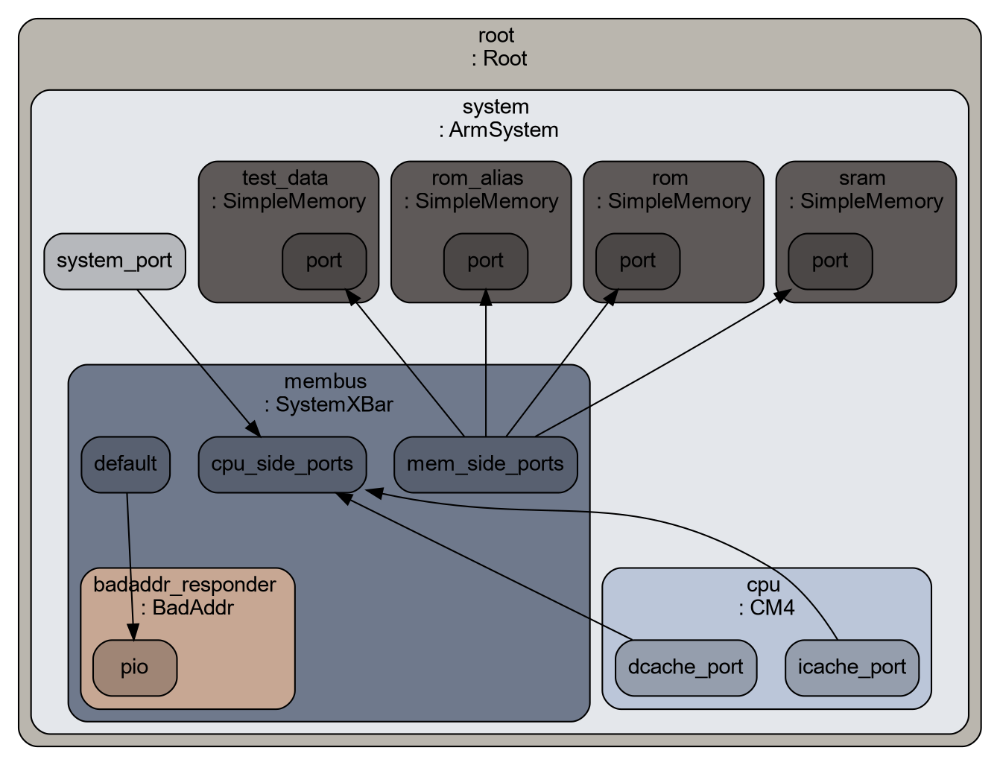

Figure \ref{fig:gem5_config} shows gem5's visualisation of the configuration
script. When compared to the sample in figure \ref{fig:gem5_config_complex},
it's clear that the configuration used for this project is much simpler.

### Loading raw firmware images

`ARMROMWorkload` is, as described above, a custom `SimObject` that adds the
capability to load raw firmware images into gem5. Its main implementation is at
`src/perfgrade/workload.cc`, with the Python binding file at
`src/perfgrade/ARMROMWorkload.py` (within the modified gem5 source tree used in
this project). Since the purpose of a `Workload` implementation in gem5 is to
set up initial system state and load code into memory, the C++ class essentially
boils down to a series of unconditional steps. In the constructor:

1. `Loader::RawImage` is used to perform the actual read of the firmware image
   from disk.
2. The address of the entry point is read from the vector table. As defined by
   the ARMv7-M architecture, the vector table is at address `0x00000000` and
   the reset handler is at offset 0x4 in within the table [@armv7m].
3. The reset handler's address is written into the workload's symbol table as
   `_start`. Debugging output from gem5 will show addresses relative to this
   symbol.Normally this would be filled from a symbol table in an ELF
   executable.

In `initState()`:

1. The ROM is written into memory at `0x08000000` and `0x00000000`, as defined
   by the memory map [@cortex_m4].
2. A magic value (`0xcafebabe`) is written into the memory location within
   the System Control Space (SCS) that normally holds CPUID information
   [@armv7m]. This is done so that simulated code can easily determine whether
   or not it is running within gem5 or real hardware.
3. The CPU state is reset.
4. The stack pointer is set to the initial value defined in the vector table
   (offset `0x0`).
5. Necessary flags are set to ensure the CPU is in Thumb mode, since ARMv7-M
   can only execute Thumb instructions [@armv7m].

### Generating machine-readable traces

`PerfgradeTracer`, as described, replaces the default tracer implementation in
gem5 in order to generate trace data that is easier to process later (for
anaylsis). It is essentially a simplified version of the default tracer that
creates a protocol buffer-based output file instead of print human-readable
trace information. Its C++ implementation is located at
`src/perfgrade/tracer.cc`, along with its Python binding at
`src/perfgrade/PerfgradeTracer.py`.

``` {.protobuf label="lst:trace-proto" caption="Protocol buffer definition for traces"}
syntax = "proto2";
package PGProto;

message Header {
  required uint64 tick_freq = 1;
}

message MemAccess {
  required uint64 addr = 1;
  required uint32 size = 2;
}

message ExecTrace {
  required fixed64 tick = 1;
  required fixed64 cycle = 2;
  required uint64 pc = 3;
  optional uint32 upc = 4;

  required bool predicate = 5;
  optional uint64 data = 6;
  optional MemAccess mem = 7;
}
```

Listing \ref{lst:trace-proto} shows the complete definition of the protocol
buffer used for trace data. Protocol buffers are essentially a set of tools
which allow the creation of efficient binary file formats from a simple
definition. The `protoc` tool is able to generate code in a number of languages
that can read and write protobufs from the definition [@protobufs]. gem5
actually already provides some scaffolding to support the use of protobufs.
`ProtoOutputStream` is a convenience class which can take a message and write it
out to a file in the runtime gem5 output directory, automatically prepending the
message's length and transparently providing gzip compression (if desired).

The `PerfgradeTracer` class then acts as a fairly simple implementation of
`Tracer::InstTracer`, including all of the information in the protobuf
definition. On startup, a `Header` message is written which specifies the tick
frequency. When `TracerRecord::dump()` is called, an `ExecTrace` message is
written out to file. `upc` is the "micro-op program counter" value, which is
relevant in the case of instructions that are broken down into so-called
micro-ops, such as `ldm`, which breaks down into a series of loads [@armv7m].
`predicate` is always true, unless a conditional instruction (e.g. `beq`)
is not executed. `data`'s value varies, generally meaning the result of an
operation (e.g. the sum of an `add`). `mem` is present only in the case of a
memory access.

### Loading and dumping memory for testing

In order to aid with testing, the `MemDump` `SimObject` provides some helper
methods. While the prior two custom objects only take a single parameter each
across the Python binding layer , `MemDump` exports 3 methods this way, along
with requiring a `System` object as a parameter (in order to access memory).
This binding file is located at `src/perfgrade/MemDump.py`. The C++
implementation, at `src/perfgrade/mem_dump.cc`, is relatively simple. It mostly
relies on the infrastructure provided by gem5's internals.

#### `dump()`

This method is typically called once the simulation has finished (see the
configuration script), and accepts a filename and address range. The contents
of memory in the address range is read into a simple buffer using the `System`
object's physical memory proxy (traversing the configured memory bus). gem5's
`OutputStream` class is then used to write the contents of this buffer out to a
file in the globally configured output directory.

#### `load()`

Essentially the opposite of `dump()`. The contents of the provided
file are read into a buffer before being written into memory at the given
address via the `System`'s physical memory proxy.

#### `loadWhen()`

Works in exactly the same manner as `load()`, but defers the actual operation to
a point in time when the program counter reaches the provided
value, taking advantage of gem5's event-based architecture. The use of this
function is to get around certain initialization routines which can zero out
space allocated for test data (in the `.bss` section). `PCEvent` is a type
of event provided by gem5 that is processed when the program counter equals a
certain value. `LoadEvent` extends this class with a `process()` method
that simply performs the same operation as `load()`. `loadWhen()` queues an
appropriate `LoadEvent` when called.

### Stopping the simulation

While a user-mode program typically exits using an `exit()` syscall (or
equivalent on non-Unix systems), there is no equivalent in the case of a
microcontroller. Simple programs typically lock the processor in an infinite
loop when complete. Since simulations often need to have a definite end (such as
in the case of this project's evaluation of submissions), gem5
provides a solution via its "`m5ops`". These are fake CPU opcodes that gem5
implements to perform simulator-specific operations, such as dumping statistics,
switching the CPU model or shutting down the simulation altogether
[@gem5_m5ops]. In order to stop gem5, the evaluated program simply needs to use
the opcode for the `exit` op.

## Unified firmware

In order to simplify evaluation of programs in both hardware and software, a
sort of "unified firmware" support was created. Essentially, this is specialised
microcontroller startup code which is set up to support running in both a
simulator and real hardware. When linking a submission to this code, the final
firmware image can run unmodified in both environments. In theory a perfect
simulator wouldn't require any specific code to account for differences in
the environment. However, with gem5 not being set up to simulate a Cortex-M4 and
diminishing returns on attempting to improve simulation accuracy, it's easier to
make some exceptions for specific differences. Assignments typically require the
submission of a source file with just their solution code, so startup code is
needed anyway.

### `libopencm3`

`libopencm3` is a free and open-source project that aims to create a "firmware
library for various ARM Cortex-M3 microcontrollers, including ST STM32 and
others". Originally created as `libopenstm32` for STM32 Cortex-M3-based boards,
support has been greatly expanded and includes STM32F4-based microcontrollers
[@libopencm3]. While it doesn't provide a high-level HAL or implement helpers to
support all of the peripherals exposed by the STM32F407, almost all of the
hardware registers are defined and a `make`-based build template is available
(`libopencm3-template`). `libopencm3`'s only dependency is an `arm-none-eabi`
toolchain. The source tree for the helper code is located at
`app/perfgrade/build/`. Each of the important components will be described in
their own section.

### `rules.mk` and `Makefile`

``` {.makefile label="lst:fw-makefile" caption="Universal firmware Makefile"}
PROJECT = perfgrade
BUILD_DIR = bin

CSTD = -std=c11
INCLUDES += -Iinclude
VPATH += src
CFILES = src/main.c
AFILES = src/util.S

DEVICE = stm32f407vgt6
#OOCD_FILE = board/stm32f1nucleo.cfg
#OOCD_FILE = board/stm32f4discovery.cfg
#OOCD_FILE = openocd.cfg

# You shouldn't have to edit anything below here.
# VPATH += $(SHARED_DIR)
# INCLUDES += $(patsubst %,-I%, . $(SHARED_DIR))
# OPENCM3_DIR=libopencm3

include $(OPENCM3_DIR)/mk/genlink-config.mk
include rules.mk
include $(OPENCM3_DIR)/mk/genlink-rules.mk
```

These are mostly copied from the project template provided by `libopencm3` and
follow a fairly typical pattern: `rules.mk` contains a set of common `make`
rules and all of the sources and options are defined in the top-level
`Makefile` (listing \ref{lst:fw-makefile}).

- The final target's basename (`$PROJECT`) is set up to be `perfgrade`
  (producing binaries like `perfgrade.elf` and `perfgrade.bin`).
- `$DEVICE` is set to `stm32f407vgt6`, which is the exact chip used in the
  STM32F4 Discovery board. `libopencm3` will automatically generate a linker
  script based on this definition.
- `$OOCD_FILE` entries are commented out, but `board/stm32f4discovery.cfg` can be
  set for debugging. OpenOCD is used later for testing the firmware in real
  hardware. `rules.mk` references this variable in rules that make use of
  OpenOCD (e.g. to flash firmware).
- `$OPENCM3_DIR` isn't set in this file, but is required (set later on the
  command line by Perfgrade). This variable points to a `libopencm3` tree that
  has been pre-built - `make -C $OPENCM3_DIR` would be enough.
- `$CFILES` and `$AFILES` are used to specify the C and assembly sources that
  should be built and linked into the final firmware. In this case only the
  startup code provided is listed. Perfgrade will redefine these variables on
  the command line to include the actual student submission.

### `util.S`

``` {.nasm label="lst:fw-util" caption="Universal firmware utilities"}
.syntax unified
.thumb
.section .text

.global m5_exit
m5_exit:
  .short 0xEE00 | 0x21
  .short 0x0110
  bx lr
```

Listing \ref{lst:fw-util} shows the entire `src/util.S`. It provides a single
"function" (whose signature is defined in `include/util.h`): `m5_exit()`. This
is just an implementation of the `exit` `m5op` (as described in the gem5
evaluation section). Since the `m5ops` use fake opcodes, assembler directives
are used to write them into the output. The `bx lr` is actually unnecessary,
since the simulation stops immediately upon encountering an `exit`.

### `main.c`

This file contains the actual `main()` function, which is called by
`libopencm3`'s implementation of the reset handler (at `lib/cm3/vector.c` in the
`libopencm3` source tree). The reset handler does a minimal set of tasks before
calling `main()`, loading data into memory from the `.data` section, zeroing
data in the `.bss` section and executing constructors.

``` {.c label="lst:fw-main" caption="Unified firmware main function"}
static inline bool is_sim(void) {
    return SCB_CPUID == 0xcafebabe;
}

static inline void null_do(void) {
    test();
}
static inline void null_finish(void) {}

#pragma weak do_test = null_do
#pragma weak finish_test = null_finish

int main(void) {
    if (!is_sim()) {
        // Bring the clock up to 168MHz
        rcc_clock_setup_pll(&rcc_hse_8mhz_3v3[RCC_CLOCK_3V3_168MHZ]);

        // TODO: Fine-grained cycle counting
        dwt_enable_cycle_counter();
        DWT_CYCCNT = 0;
    }

    do_test();
__asm__("test_end:");
    finish_test();

    if (!is_sim()) {
        // Clock down the CPU now that we're done
        rcc_clock_setup_pll(&hsi_2mhz);
    } else {
        m5_exit(0);
    }

__asm__("eval_done:");

    return 0;
}
```

Listing \ref{lst:fw-main} shows (most of) `src/main.c`, with the definition of
`hsi_2mhz` excluded. The definition and use of `is_sim()` shows the blocks of
code which are simulator or hardware specific. It's possible to determine if the
firmware is running in gem5 by reading the `SCB_CPUID` register, since it has a
magic value written to it in the simulator case (as previously discussed).

If not running in gem5, (i.e. `!is_sim()`), the `libopencm3` function
`rcc_clock_setup_pll()` is used to set the core clock for the STM32F407. By
default, the 16MHz internal oscillator is used to drive all clocks on the chip,
(including `HCLK` / `SYSCLK`, the core clock [@stm32f407]. In order to maximise
performance, the core clock is increased to 168MHz, which is the highest
recommended value [@stm32f407vg].

The process through which this is achieved is
relatively complex, and involves a series of registers within the Reset and
Clock Control (RCC) peripheral. These set the values for a number of clock
divisors, multipliers and the Phase-Locked Loop (PLL). Each component has a its
own range of operation, so each parameter must be balanced to achieve the final
desired clock speed. Clocks for other components, such as on the peripheral
bus (APB) must be considered. `rcc_clock_setup_pll()` abstracts away this
process, making use of the PLL. `libopencm3` contains a set of preset
configurations based around specific clock speeds -
`rcc_hse_8mhz_3v3[RCC_CLOCK_3V3_168MHZ]` uses the external 8MHz crystal
oscillator to achieve a `HCLK` / `SYSCLK` of 168MHz.

Once the clock is set up, the Data Watchpoint and Trace unit's (DWT) cycle
counter is enabled and reset. This is used to count cycles (see the hardware
evaluation section).

`do_test()` is called to set up and execute the actual code being evaluated.
`#pragma weak` is used to weakly set the value of this symbol to `null_do()`.
Since special code might be required to set up and jump into the test code, the
default provided by `null_do()` can then be redefined by an optional custom test
harness that is linked in later. `__asm__()` is used to export a symbol
`test_end` once `do_test()` returns to allow the address of the first instruction
following test code completion to be determined programmatically.
`finish_test()`, which is weakly assigned to `null_finish()` (which does
nothing), can also be re-defined later if custom test cleanup code is needed.

If the firmware is running in hardware, `rcc_clock_setup_pll()` is used again
to reduce the core clock all the way down to 2MHz so that the microcontroller
isn't left in an infinite loop at high frequency for an extended period once
`main()` returns. `hsi_2mhz` configures all of the necessary clock components
to run off of the internal oscillator with a final core clock of 2MHz. The
complete configuration can be found in the non-abridged `src/main.c`.

If the firmware is running in gem5, the `m5op` `exit` stops the simulation at
this point. `eval_done` is exported for programmatic determination of the end
of `main()` in real hardware.

## Hardware evaluation

With the implementation of a unified firmware to execute test code that
leverages `libopencm3`, the remaining requirement for evaluation in hardware
is a method of instrumentation. `libopencm3` provides the basics to debug code
running on a real board with OpenOCD, the Open On-Chip Debugger. The purpose of
OpenOCD is to utilise a "debug adapter" to interface with the microcontroller
and provide a software abstraction for access to debug features. Key features
include the ability to flash firmware and a `gdbserver` implementation
[@openocd_about].

### Debugging with OpenOCD

`libopencm3`'s `make` rules and OpenOCD make it quite easy to debug code on the
STM32F4 Discovery board. Setting up the debug adapter is as easy as connecting
a mini USB cable to the STM32F4 Discovery board, which presents the ST-LINK/V2
to the host [@stm32f4_discovery]. the `perfgrade.flash` target will make use of
OpenOCD to flash firmware to the board. Running
`openocd -f board/stm32f4discovery.cfg` will start an OpenOCD server which
connects to the debugger, using a pre-made configuration designed specifically
for the Discovery board. Port 4444 runs a `telnet` server which can be used to
execute OpenOCD-specific commands, such as flashing firmware. A `gdbserver` will
be opened on port 3333, and a `gdb` build supporting ARM can then be used to
step through the firmware running on the board.

### Cycle counting with the DWT

As alluded to in the unified firmware section, the ARMv7-M's standard Debug and
Watchpoint Trace unit (DWT) can be used to count cycles on the STM32F407. The
only setup needed is to write a 1 to the `CYCCNTENA` bit in the `DWT_CTRL`
register, which is done by `libopencm3`'s `dwt_enable_cycle_counter()` function.
Following this `DWT_CYCCNT` will increment for every cycle of the core clock
[@armv7m]. Additionally, `DWT_CYCCNT` can be written to in order to reset its
value.

### PyOCD and automation

While OpenOCD is a popular and well-supported tool for interfacing with
STM32 microcontrollers, it doesn't lend itself very well to automation. In order
to manage hardware state (e.g. flashing and reading cycle counts) when
evaluating student code in the Perfgrade system, flexible automation will be
important. pyOCD provides a Python-based library and application for interfacing
with Cortex-M-based microcontrollers. By utilising standardised "CMSIS packs"
(Cortex Microcontroller Software Interface Standard) provided by ARM, pyOCD
supports the majority of Cortex-M products on the market [@pyocd].

In many cases pyOCD can act as a drop-in replacement for OpenOCD, since it
provides its own CLI and `gdbserver` implementation. Its real value to this
project is its Python API, however. Since the Perfgrade platform is written in
Python, it's possible to use pyOCD to directly interact with a microcontroller
in a normal program. For example, setting a breakpoint is as simple as
calling `target.set_breakpoint(addr)`.

## Hardware tracing

Hardware tracing was attempted for this project, although this avenue ultimately
proved impractical. Ideally it would have been possible to make use of standard
ARM hardware to generate traces in the same format as gem5, but due to the
complexities and limitations of the implementation, this approach was not
successful.

### The Embedded Trace Macrocell

ARM defines the Embedded Trace Macrocell (ETM) as a standard part of the
CoreSight Architecture. Variations of the ETM are implemented across ARM's
products, including high-performance Cortex-A cores. The ETM "is a real-time
trace module providing instruction and data tracing of a processor" [@etm].
Since it is so widely used, separate reference manuals are used to define the
specific parameters and behaviour of an ETM for different ARM cores. For a
Cortex-M4 microcontroller, the ETM is specifically referred to as the ETM-M4
[@etm_m4]. This is an optional component for the Cortex-M4 (which *is* included
in the STM32F407) that supports only instruction tracing (no data) and its
output is often incorporated into the Trace Port Interface Unit, as is the case
for the STM32F407 [@stm32f407].

One implementation that's not immediately obvious with the ETM-M4 is support
for cycle-accurate tracing, which is actually optional as specified in the main
ETM manual. The official procedure to check for cycle-accurate tracing support
is to write to write a 1 to bit 12 in the `ETMCR` (ETM Control Register) and
check if the value remains set afterwards [@etm]. The ETM-M4 manual's specifies
that bit 12 of the `ETMCR` is "Reserved" and attempting write a 1 to this bit
failed with the STM32F407. Unfortunately this was not discovered until partially
successful tracing was achieved.

Typically, interfacing with the ETM requires the use of expensive hardware and
proprietary software, such as ARM's own ULINKpro, which was priced as $1,250
(at time of writing) and is designed for use with Keil uVision [@ulink_pro]. The
high cost is partially due to the fact that high performance (potentially
multi-GHz) cores will produce a significant amount of trace data, which is
difficult to process.

### The Trace Port Interface Unit

Since there are a number of related debug / tracing components present on a
Cortex-M4-based microcontroller, a Trace Port Interface Unit (TPIU) is often
included to multiplex the data from each source [@armv7m]. The result is pushed
out over microcontroller pins using the TPIU's own framing protocol, which is
described as part of the CoreSight Architecture Specification [@coresight].
There are two primary output modes:

- Asynchronous. This effectively acts as a unidirectional UART (operating at
  a very high speed). Output is written to the Serial Wire Output pin (SWO).
  Often used with the Instrumentation Trace Macrocell as a
  pseudo serial port. Baud rate is CPU clock divided by a configurable amount.
- Synchronous. A parallel interface of configurable width (1 to 4 bits for
  Cortex-M4). Provides its own clock which is operates at half of the core
  clock, but data should be read on both the falling and rising edges.

Asynchronous mode is easier to set up and requires only a single pin but
synchronous mode can be more reliable (with a dedicated clock signal) and
provide more bandwidth.

### sigrok and logic analysers

sigrok is a project to create a free and open-source signal analysis software
suite, mostly as part of `libsigrok`, which provides an abstration over a wide
range of hardware [@sigrok]. Logic analysers provide a low-cost way to capture
high-frequency signals from digital logic components, and Chinese knockoff
devices can be purchased for around €10. The device used for this project is a
clone of a Saleae logic analyser that is based around a Cypress FX2 chip
[@saleae_clone]. The Cypress FX2 is essentially a general purpose
high-bandwidth USB microcontroller, allowing the implementation of virtually
any wire protocol over USB using a "General Purpose Programmable Interface
(GPIF)" [@cypress_fx2]. This makes it ideal for use as a logic analyser.

In order to capture and analyse signals with `libsigrok`, a tool such as the
`sigrok-cli` or PulseView (Qt-based GUI) is used. sigrok uses the `fx2lafw`
firmware (a sub-project of sigrok) to capture signals with Cypress FX2-based
logic analysers [@fx2lafw]. sigrok makes use of a "stacking" protocol decoder
system. This allows the output of one decoder to be passed to another. This
modular design allows complex protocols to reuse existing decoders. For example,
many protocols can be "stacked" atop the UART decoder if they are based on data
from a serial port.

### Decoding ETM data in PulseView

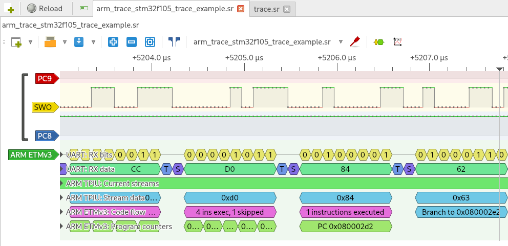

As part of an article about tracing on STM32 platforms, sigrok protocol decoders
for the TPIU and ETM were contributed to sigrok.
This article additionally describes the general setup required to start
capturing on a microcontroller and viewing this data in PulseView
[@stm32_tracing]. Figure \ref{fig:trace-swo} shows the TPIU and ETM protocol
decoders stacked on top of a UART decoder.

Note that this is using sample data
provided by the author of the article - capturing SWO data at high baud rates
(8 megabaud as suggested) proved to be unstable and often corrupted. The focus
for tracing in this project shifted to the TPIU's synchronous mode, which is not
implemented by the TPIU and ETM decoders included with sigrok.

### Setting up the STM32F4 Discovery hardware for tracing

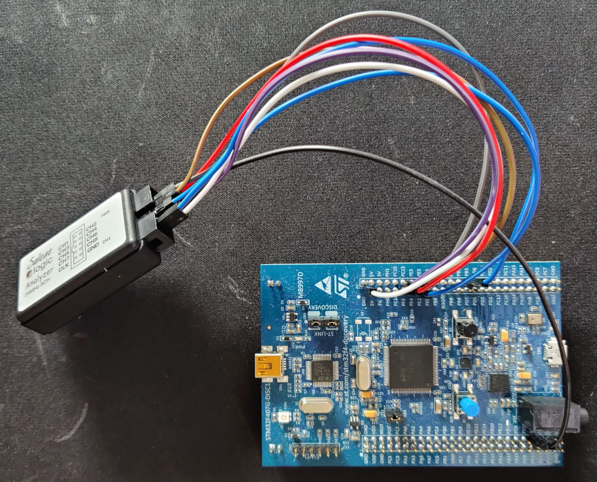

In order to begin generating trace data with the STM32F4 Discovery board, a
relatively sophisticated hardware and firmware setup is needed. Figure
\ref{fig:trace-hardware} shows the knockoff logic analyser connected to the
required pins [@stm32f407]:

- `GND` (white).
- `PB3` (aka `SWO`; rightmost blue). Used for testing of asynchronous TPIU mode.
- `PE2` (aka `TRACECLK`; left blue). Dedicated clock for synchronous TPIU mode.
- `PE3` to `PE6` (aka `TRACED0` to `TRACED3`; brown, red, grey and purple).
  Parallel data pins for synchronous TPIU mode.
- `PD12` (black). Connected to green LED on STM32F4 discovery board
  [@stm32f4_discovery], used for debugging and testing of logic analyser.

``` {.c label="lst:trace-gpio" caption="Releasing trace pins from GPIO"}
rcc_periph_clock_enable(RCC_GPIOE);
gpio_mode_setup(GPIOE, GPIO_MODE_AF, GPIO_PUPD_NONE, GPIO2 | GPIO3 | GPIO4 | GPIO5 | GPIO6);
gpio_set_af(GPIOE, GPIO_AF0, GPIO2 | GPIO3 | GPIO4 | GPIO5 | GPIO6);
```

### ETM configuration

Once the hardware is set up, a multitude of registers must be configured to
generate trace data in the appropriate format. A test firmware utilising
`libopencm3` was written for this task. Before all of these registers can be
written however, the required means must be released from GPIO. Listing
\ref{lst:trace-gpio} shows this process, making use of `libopencm3`'s GPIO
abstraction functions.

``` {.c label="lst:trace-dbgmcu" caption="Enabling the trace pins"}
// Enable trace pins
DBGMCU_CR |= DBGMCU_CR_TRACE_IOEN;
// 4-bit synchronous mode
DBGMCU_CR &= ~DBGMCU_CR_TRACE_MODE_MASK;
DBGMCU_CR |= DBGMCU_CR_TRACE_MODE_SYNC_4;
```

The first step towards tracing is to enable the trace IO pins. This is done by
writing to the Debug MCU configuration register or `DBGMCU_CR` [@stm32f407].
Listing \ref{lst:trace-dbgmcu} shows `TRACE_IOEN` being set to 1 along with the
appropriate value for 4-bit synchronous mode in `TRACE_MODE`.

``` {.c label="lst:trace-tpiu-config" caption="Enabling the trace pins"}
// Enable access to TPIU registers
SCS_DEMCR |= SCS_DEMCR_TRCENA;
// Port is 4 bit
TPIU_CSPSR = (1 << 3);
TPIU_FFCR =
    TPIU_FFCR_TRIGIN | // Indicate triggers
    TPIU_FFCR_ENFCONT; // Enable formatter
// Parallel protocol
TPIU_SPPR &= ~0b11;
```

Once the trace pins are configured, the TPIU must be set up. Listing
\ref{lst:trace-tpiu-config} shows:

1. The `TRCENA` bit of the Debug Exception and Monitor Control Register (or
   `DEMCR`) must be set. This enables the use of a number of trace features,
   including the DWT, ITM and TPIU [@armv7m].
2. Writing to the Current Parallel Port Size Register (`TPIU_CSPSR`)
   configures the width of the TPIU's parallel port, which in this case should be
   4-bit, the maximum for the Cortex-M4 [@armv7m].
3. The `TRIGIN` and `ENFCONT` bits of the TPIU Formatter and Flush Control
   Register (`TPIU_FFCR`) are set so that the TPIU emits a sequence when tracing
   begins and always formats input data [@cortex_m4].
4. Finally, the TPIU Selected Pin Protocol Register (`TPIU_SPPR`) is set to 0 to
   select parallel trace mode.

``` {.c label="lst:trace-dwt-config" caption="Setting up DWT comparators to trigger tracing"}
// Comparator 0: Match precise start address of test function (as input to
// ETMTRIGGER and the EmbeddedICE start resource)
// Program exact address of test function
DWT_COMP(0) = test;
// Disable mask (exact address, halfword aligned)
DWT_MASK(0) = 0;
// Enable address comparison functions
DWT_FUNCTION(0) &= ~(DWT_FUNCTIONx_DATAVMATCH | DWT_FUNCTIONx_CYCMATCH);
// Generate CMPMATCH[0] event on instruction address (also enables comparator)
DWT_FUNCTION(0) |= 0b1000;

// Comparator 1: Match precise end address of test function (as input to the
// EmbeddedICE stop resource)
// Program exact address of last instruction in test function
DWT_COMP(1) = test_end;
// Disable mask (exact address, halfword aligned)
DWT_MASK(1) = 0;
// Enable address comparison functions
DWT_FUNCTION(1) &= ~(DWT_FUNCTIONx_DATAVMATCH | DWT_FUNCTIONx_CYCMATCH);
// Generate CMPMATCH[1] event on instruction address (also enables comparator)
DWT_FUNCTION(1) |= 0b1000;
```

In order to limit the generation of trace data to just the test code, the
previously mentioned DWT can be used. Listing \ref{lst:trace-dwt-config} shows
configuration of 2 of the DWT's comparators to trigger when the PC reaches the
start and end of the test code respectively [@armv7m]. The exact setup process
will not be described, but essentially:

1. The comparator's value is set to the address of the labels defined for the
   start or end
2. Address masking is disabled (exact match)
3. The comparator is set to address comparison mode (PC value)
4. The comparator is set to generate a `CMPMATCH` event, which is fed into the
   ETM

``` {.c label="lst:trace-etm-config" caption="Setting up the ETM"}
// Unlock ETM registers
ETMLAR = CORESIGHT_LAR_KEY;

// Config mode
ETMCR |= ETMCR_PROGRAMMING;
ETMCR =
    ETMCR_ETMEN |           // Enable ETM
    ETMCR_TIMESTAMP |       // Enable timestamping
    ETMCR_BRANCH_OUTPUT |   // Enable branch output
    //ETMCR_CYCLETRACE |
    ETMCR_STALL_PROCESSOR;  // Stall processor when buffer is full
// TPIU bus ID
ETMTRACEIDR = 69;
// TraceEnable is controlled by start/stop
ETMTECR1 |= ETMTECR1_TCENABLED;
// Stall when less than 24 bytes in FIFO (24 is the size of the FIFO)
ETMFFLR = 24;
```

At this point, only the ETM itself is left to configure. Listing
\ref{lst:trace-etm-config} shows the first part of this process:

1. In order to configure the ETM, it must first be unlocked. This is done by
   writing `0x5acce55` to the ETM Lock Access Register (`ETMLAR`) [@etm].
2. Programming mode must be enabled be setting the `PROGRAMMING` bit in the
   ETM Main Control Register (`ETMCR`). This also stops any active trace.
3. Several flags are set in the ETMCR (see listing \ref{lst:trace-etm-config}).
   Note that `CYCLETRACE` is disabled since the ETM-M4 doesn't support
   cycle-accurate tracing.
4. The CoreSight Trace ID Register (`ETMTRACEIDR`) sets the stream ID of
   ETM data in the TPIU (since multiple components are multiplexed into the TPIU).
5. The `TCENABLED` bit is set in the TraceEnable Control 1 register (`ETMTECR1`)
   in order to enable of control trace start/stop logic.

``` {.c label="lst:trace-etm-trigger" caption="Defining ETM start/stop conditions"}
// Generate trigger on CMPMATCH[0]
ETMTRIGGER =
    TRACE_BOOL_A |                          // On A
    TRACE_RESOURCE_A(TRACE_TYPE_DWT, 0);    // A = CMPMATCH[0]

// Hardcode TraceEnable to be on (since we're using start/stop block)
ETMTEEVR =
    TRACE_BOOL_A |                                  // On A
    TRACE_RESOURCE_A(TRACE_TYPE_ALWAYS, 0b1111);    // Always true

ETMTESSEICR =
    ETMTESSEICR_START(0) |  // Start on CMPMATCH[0]
    ETMTESSEICR_STOP(1);    // Stop on CMPMATCH[1]

// Exit config mode
ETMCR &= ~ETMCR_PROGRAMMING;
```

Finally, the start/stop behaviour of the ETM is configured. Listing
\ref{lst:trace-etm-trigger} details:

1. The Trigger Event Register, `ETMTRIGGER`, is set to generate a trigger event
   (which can later be read in the stream) when the DWT `CMPMATCH[0]` event is
   raised. This was previously set up to correspond to the start of the test
   code.
2. The TraceEnable Event Register (`ETMTEEVR`) is set to always be on, since the
   start/stop block of the ETM is being used to control trace behaviour (as
   set earlier).
3. Tracing is set to start on `CMPMATCH[0]` and stop on `CMPMATCH[1]` by writing
   to theTraceEnable Start/Stop EmbeddedICE Control Register (`ETMTESSEICR`).
   In the ETM-M4, "EmbeddedICE watchpoint comparators" refer to the DWT
   comparators, hence the connection to `CMPMATCH[x]` [@etm_m4].
4. Programming mode of the ETM is exited by clearing the `PROGRAMMING` bit in
   the `ETMCR`, which enables tracing. Actual trace data will only be emitted
   once the start condition is triggered.

Note that the `ETMTRIGGER` and `ETMTEEVR` values are "ETM event resources".
These are bitfields that incorporate (a) two resource identifiers and (b) a logic
function. A resource identifier can refer to a number of different input
sources, such as a DWT comparator or a hardcoded value. The logic function then
produces an output based on one or both of the resource inputs [@etm].

### Capturing and decoding ETM data

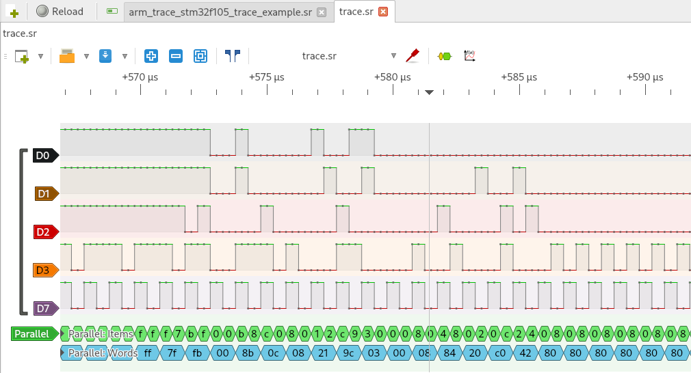

Once all of the configuration is done, TPIU data will appear on the trace pins
as shown in figure \ref{fig:trace-synchronous}. As mentioned previously, the
decoders for TPIU and ETM data included with sigrok don't support decoding
synchronous mode data. Additionally, although `libsigrok` and
`libsigrok-decode` (which provides the protocol decoders) have API's and a
number of language bindings, the decoders themselves aren't very well suited to
decoding a large amount of high-level data for machine analysis. As a result,
it was decided to write a custom Python data processing script, with the
potential for this to be ported to a faster language when completed.

Decoding of the synchronous TPIU protocol, which is slightly different to the
asynchronous variant implemented in the sigrok decoder, was successfully
implemented by referencing the ARM CoreSight Architecture manual [@coresight].
Additionally, decoding of some ETM packets (extracted from the TPIU stream)
was achieved by referencing the existing sigrok decoder as well as the ETM
specification [@etm]. It was at this point that the lack of support
cycle-accurate tracing support was discovered in the ETM-M4. The decision was
made to stop exploring hardware tracing, since cycle accuracy is important to
this project. It is also likely that a significant amount of further effort
would be required to make this work at a level equivalent to gem5's tracing
setup. The incomplete Python script, which reads in a list of 4-bit values from
a `sigrok-cli` command's output, is included with the source for this project
at `app/tpiu_decode.py`.

## Perfgrade platform

Perfgrade is the implementation of the aforementioned "glue" in this project,
providing a pipeline-based system to configure automated assignment evaluation
and grading. The system is written in Python, for ease of development and to
allow for easy scripting capabilities within pipeline definitions.

The source for the application is in the `app/` subdirectory, with the structure
following that of a standard Python library. `app/perfgrade/` contains the code
for all of the classes described in this section.

### Pipeline configuration format

``` {.yaml label="lst:perfgrade-simple" caption="Simple Perfgrade pipeline example"}
steps:
  - id: build
    type: build
    description: Build test code
    input:
      opencm3: /opt/libopencm3
      uut: arraymove.s
      harness: arraymove_harness.s
      defines:
        ARR_SPACE: !expr 1024 * 4

  - type: copy
    description: Copy build results
    input:
      - src: !expr build.elf
        dst: perfgrade.elf
      - src: !expr build.rom
        dst: perfgrade.bin
```

Listing \ref{lst:perfgrade-simple} is an example of a Perfgrade
configuration file, demonstrating the basic structure of a pipeline definition.
The outermost object contains only one key: `steps`. This is an array of step
definitions. Each step has a number of attributes:

- `id`: An optional shorthand identifier for the step, which allows its
  outputs to be referenced in future steps (as `<id>.<output_prop>`).
- `type`: The type of step being defined. A number of pre-defined step types are
  implemented in the Python application to perform a wide range of tasks.
- `description`: An optional human-readable description of the step (shown in
  logs)
- `input`: Type-specific input for the step. This usually contains options and
  references the outputs from previous steps to set up how a step will run.

An additional element seen in Listing \ref{lst:perfgrade-simple} is `!expr`,
which comes after the YAML key but before its value. A lesser-known feature,
tags, indicate the underlying type of a value. A tag is always implied but can be
explicitly specified for any node [@yaml_spec]. The `expr` tag is picked up by Perfgrade
and indicates that the value corresponding to the given key should be
evaluated as a Python expression. For example, `src: !expr build.elf` in listing
\ref{lst:perfgrade-simple} means that the value of `src` will be dynamically
evaluated to be the `elf` output from the `build` step. `!expr` tags can be used
for any input value (including nested ones), as well as the `description`.

### Step implementation

Since the Perfgrade platform is written in Python, a language with object-oriented
features, each of the step `type`s is implemented as a class inheriting from a
base `Step`. This class defines a number of methods and defines some common
behaviour, with the `run()` method needing to be implemented by all subclasses
to provide an actual action to be taken. `close()` can be implemented to perform
any cleanup when Perfgrade is shutting down.

Notably, `Step` provides `_eval_input()`, which is an internal method that
traverses the `input` tree and evaluates any `!expr`-tagged values as
expressions before `run()` is called to execute the step. The `output` instance
property should be set by the end of `run()` to provide outputs for other steps
to use. Instance property `input` can be accessed by `run()` to read the
processed input tree (with `!expr` values evaluated).

``` {.python label="lst:perfgrade-copy" caption="Perfgrade `Copy` step definition"}
class Copy(Step):
    description = 'Copy files'

    def run(self, ctx: Mapping):
        input_ = self.input
        if not isinstance(self.input, list):
            input_ = [self.input]

        for i in input_:
            if os.path.isdir(i['src']):
                shutil.copytree(i['src'], i['dst'])
            else:
                shutil.copy(i['src'], i['dst'])
```

Listing \ref{lst:perfgrade-copy} shows the complete implementation of the `copy`
step type, a simple step which allows one or more files to be copied (using the
standard library `shutil` functions). Although this step does not provide any
outputs, it references elements of the input array, each of which should have a
`src` file/directory and a `dst` file/directory. The class-level property
`description` provides a default value, used in log output if none is provided
in the configuration file. Listing \ref{lst:perfgrade-simple} shows an example
use of the `copy` step.

``` {.python label="lst:perfgrade-passthrough" caption="Perfgrade `Passthrough` step definition"}
class Passthrough(Step):
    description = 'Pass evaluated input through to output'

    def run(self, ctx: Mapping):
        self.output = self.input
```

Listing \ref{lst:perfgrade-passthrough} shows an even further simplified step
definition. At first glance, this appears to do nothing. However, recall that
`self.input` refers to the processed input tree, with all expressions evaluated.
This provides a convenient way to define via YAML a set of values to be
referenced in later steps, with the added capability to add Python expressions
at any level in the tree.

All expressions have access to the following standard modules: `struct`,
`random`, `sys`, `os` and `os.path` (as `path`). In addition, the following
external libraries are included by default: `box.Box` (as `Box`), `numpy`
(as `np`) and `matplotlib.pyplot` (as `plt`).

### Basic steps

#### `exec`

This step type takes a Python program as input, and simply evaluates it. This is
effectively a long-form version of an inline expression. While an expression
has limits and must evaluate to a value, the `exec` step uses the Python
standard `exec()` builtin to run code as if it were a complete script. This step
type is akin to the `run:` value in a GitHub Actions step.

_Inputs:_

The input value is a string, which is parsed as a Python script. All of the
modules included for `!expr` values are also included here. Use of the
YAML literal block indicator is recommended [@yaml_multiline].

_Outputs:_

None (`self.output` can be set by the script to provide an output)

_Example:_

```yaml
id: test
type: exec
input: |
  from zipfile import ZipFile

  self.output = []
  with ZipFile('spam.zip') as myzip:
      with myzip.open('eggs.txt') as myfile:
          for line in myfile:
              self.output.append(line)
```

#### `passthrough`

As previously described, this step effectively does "nothing", passing its input
(_with evaluation of nested expressions_) as the output.

_Inputs:_

An arbitrary YAML tree.

_Outputs:_

The evaluated input.

_Example:_

```yaml
id: values
type: passthrough
input:
  stuff:
    foo: bar
    qwe: 123
  a:
    b: !expr 5 * 4
```

#### `copy`

Copies files / directories.

_Inputs:_

An array of objects with `src` and `dst` values. A single object (without being
wrapped in an array) can also be provided.

_Outputs:_

None.

_Example:_

```yaml
type: copy
input:
  - src: /etc/hosts
    dst: /tmp/hosts
  - src: /usr/share/man
    dst: /tmp/man
```

### Evaluation steps

#### `build`

Builds a unified firmware (see the dedicated section for further details).

_Inputs:_

- `opencm3`: Path to pre-built `libopencm3` tree.
- `uut`: Path to the "unit under test" assembly source file.
- `harness`: Path to an optional test harness (`.c` for C or `.s`/`.S` for
  assembly). This source should export a `do_test()` function to replace the
  default implementation (this simply calls `test()`) which sets up and
  executes the test code.
- `defines`: Optional array of preprocessor defines to set (key is the name of
  the define).
- `rom`: Whether or not to produce a raw firmware from the final ELF (defaults
  to `True`).

_Outputs:_

- `dir`: Path to the temporary build directory
- `uut`: Path of the copied uut (relative to the temporary build directory)
- `elf`: Absolute path to the final ELF
- `rom`: Absolute path to the final raw firmware (if requested)

**Note:** The resulting ELF and optional ROM are stored in a temporary
directory which will be deleted upon Perfgrade's exit. Consider using a `copy`
step if they are required after a pipeline has finished executing.

_Example:_

```yaml
id: build
type: build
input:
  opencm3: /opt/libopencm3
  uut: arraymove.s
  harness: arraymove_harness.s
  defines:
    ARR_SPACE: !expr 1024 * 4
```

#### `symtab`

Loads the symbol table from an ELF binary, utilising the `pytelftools` library.
`pyelftools` is "a pure-Python library for parsing and analyzing ELF files and
DWARF debugging information" [@pyelftools].

_Inputs:_

A single string, which is the path to an ELF binary.

_Output:_

A `SymbolResolver`. This can be used to look up the address of a symbol in the
ELF's symbol table, accessed as with a dictionary (using `dict['key']` syntax).
If a tuple of `('symbol', n)` is used as the key instead of just a symbol name,
the returned address will have its lowest `n` bits masked off (useful for
de-Thumb'ifying function addresses, which sometimes have the LSB set to force
a switch to Thumb mode).

_Example:_

```yaml
steps:
  - id: tab
    type: symtab
    input: perfgrade.elf

  - type: exec
    input: |
      print(f'Address of entrypoint: {symtab[("_start", 2)]}')
```

#### `evaluate`

Performs evaluation of programs, either in software with gem5 or in hardware
with a real STM32F4 Discovery board (via pyOCD). Should be used with a unified
firmware (as described in the dedicated section).

In `simulation` mode, the
evaluation setup described in the "gem5 evaluation" section is used. The
appropriate gem5 command is constructed and executed, with data being collected
from the output directory.

In `hardware` mode, pyOCD is used to manage real boards (as described) in the
"hardware evaluation" section. Since opening and closing connection to a board
is quite expensive with pyOCD, connections are pooled globally. Connections are
only closed either when they have been unused for more than 20 seconds or
Perfgrade is shutting down.

_Inputs:_

Common (both modes):

- `type`: Mode to run in. `simulation` (for software / gem5) or `hardware`,
  required.
- `firmware`: Path to a raw unified firmware binary, required.
- `timeout`: Maximum amount of evaluation time (seconds). If exceeded, an
  exception is raised, if unspecified no timeout is enforced.
- `debug`: Print extra logging information, defaults to false.
- `gem5`: Path to gem5 source tree. Required for simulation mode. If specified
  in hardware mode, a dummy trace file will be generated.
- `test_data`: Object specifying test data to load into memory:
  - `addr`: Address to load test data to, required
  - `data`: Path to file to be loaded at `addr` (binary), required
  - `when`: PC value to wait for before loading data, optional
- `dump_ranges`: Array, each element contains a range of memory to dump on
  evaluation completion:
  - `start`: Start address of range to dump, required
  - `size`: Size of range to dump, required

`simulation`-only:

- `variant`: The gem5 build variant to use, defaults to `fast`.
- `config`: Configuration script name (without `.py`). Choices are in
  `app/perfgrade/gem5_config/`, defaults to `stm32f4`.
- `extra_args`: List of additional command line arguments to pass to gem5.

`hardware`-only:

- `target`: pyOCD target to use, defaults to `stm32f407vg`.
- `probes`: List of probe ID's to use. Connected probes can be listed by running
  `pyocd list --probes`.
- `cycles_addr`: Address of 32-bit integer to read cycle count from, defaults to
  the address of `DWT_CYCCNT`.
- `start_addr`: Address of starting dummy trace instruction, optional.
- `end_addr`: Address of final dummy trace instruction, optional.
- `extra_options`: A dict of additional options to pass to
  `pyocd.core.session.Session(options=options)`, optional.

_Outputs:_

- `dump`: A list of byte arrays representing each of the requested memory ranges
  provided in `dump_ranges`.
- `trace`: Path to a *temporary* file containing trace data in the protobuf
  format described in the "gem5 evaluation" section. In hardware mode this will
  only be provided if the `gem5` option was set. Since hardware tracing is not
  implemented, a "fake" trace file is generated. This contains only 2 trace
  entries: a start and end instruction, which is still useful for calculating
  the total cycle count (e.g. via the `cycle_count` step).

_Examples:_

```yaml
type: evaluate
input:
  type: simulation
  timeout: 5
  debug: true

  gem5: /opt/gem5
  variant: opt

  firmware: 'perfgrade.bin'

  test_data:
    addr: !expr symtab['loop_size']
    data: !expr struct.pack("<I", 30)
    # For some reason main mis-aligned (to force switch to Thumb?)
    when: !expr symtab[('main', 2)]
```

```yaml
type: evaluate
input:
  type: hardware
  timeout: 10

  start_addr: !expr symtab['do_test']
  done_addr: !expr symtab['eval_done']
  probes:
    - 066CFF303430484257251617
    - 0671FF485648756687013343
  gem5: /opt/gem5
  extra_options:
    # Load the STM32F4 CMSIS pack
    pack: /opt/perfgrade/stm32f4.pack

  firmware: 'perfgrade.bin'

  test_data:
    addr: !expr symtab['loop_size']
    data: !expr struct.pack("<I", 30)
    when: !expr symtab[('main', 2)]
```

### Metric steps

#### `load_traces`

Streams trace data from a protobuf file in the format described in the "gem5
evaluation" section (compatible with the `traces` output from an `evaluation`
step).

_Inputs:_

- `file`: Path to trace file, required.
- `gem5`: Path to gem5 source tree, required.

_Output:_

A `TraceStream`. This can be iterated over (streaming data in as needed). The
header message can be accessed via the `header` property.

_Example:_

```yaml
steps:
  - id: traces
    type: load_traces
    input:
      gem5: /opt/gem5
      file: !expr eval.traces
  - type: exec
    input: |
      print(traces.header)
      for t in traces:
          print(t)
```

#### `augment_traces`

"Augments" an existing trace stream by adding a source file and line number to
each trace item (where possible). This is done by using `pyelftools` to parse
the DWARF debugging information embedded within a provided ELF binary.

_Inputs:_

- `traces`: A `TraceStream` (the output of a `traces` step), required.
- `elf`: Path to an ELF binary to read DWARF information from, required.

_Output:_

An `AugmentedTraceStream`, which is like a `TraceStream` but with a `filename`
and `line` number property in each element. The original trace message can be
accessed via the `orig` property.

_Example:_

```yaml
steps:
  - id: traces
    type: load_traces
    input:
      gem5: /opt/gem5
      file: !expr eval.traces
  - id: extra_traces
    type: augment_traces
    input:
      traces: !expr traces
      elf: perfgrade.elf
  - type: exec
    input: |
      for t in extra_traces:
          print(t)
```

#### `cycle_count`

Counts total cycles in a trace, optionally only counting between a start and
stop address.

_Inputs:_

- `traces`: `TraceStream` (from a `traces` step), required.
- `first_pc`: Address at which to start counting cycles, optional.
- `last_pc`: Address at which to stop counting cycles, optional.

_Outputs:_

- `ticks`: Simulator ticks elapsed in the trace
- `cycles`: CPU cycles elapsed in the trace

_Example:_

```yaml
steps:
  - id: traces
    type: load_traces
    input:
      gem5: /opt/gem5
      file: !expr eval.traces
  - id: cyc
    type: cycle_count
    input:
      traces: !expr traces
      first_pc: !expr symtab['Main']
      last_pc: !expr symtab['test_end']
  - type: exec
    input: |
      print(f'Cycles: {cyc.cycles}')
```

### Statistic steps

#### `heatmap`

Generates a heatmap similar to the one described in the "design" section from a
trace.

_Inputs:_

- `source`: Path to source file to render a heatmap of, required.
- `compilation_unit`: Name of the compilation unit in the DWARF debugging
  information, required. This is usually the name of the source file relative to
  the path of the working directory used when building the firmware. Should be
  `src/uut.S` when using unified firmware and the `build` step.
- `traces`: `AugmentedTraceStream` object (from an `augment_traces` step),
  required.
- `total_cycles`: Total cycle count, required.
- `html_out`: Filename to write the rendered HTML to, optional.

_Output:_

A HTML string of the rendered heatmap.

_Example:_

```yaml
steps:
  - id: traces
    type: load_traces
    input:
      gem5: /opt/gem5
      file: !expr eval.traces
  - id: cyc
    type: cycle_count
    input:
      traces: !expr traces
      first_pc: !expr symtab['Main']
      last_pc: !expr symtab['test_end']
  - id: extra_traces
    type: augment_traces
    input:
      traces: !expr traces
      elf: perfgrade.elf
  - type: heatmap
    input:
      source: expressions.s
      compilation_unit: src/uut.S

      traces: !expr extra_traces
      total_cycles: !expr cyc.cycles

      html_out: heatmap.html
```

#### `curve_guess`

Uses `scipy.optimize.curve_fit()` to guess the closest function that matches a
set of input points [@scipy_curve_fit].

_Inputs:_

- `functions`: A dict of key-value pairs where each value is of the form
  required by `scipy.optimize.curve_fit()`, required.
- `data`: An object:
  - `x`: Array of X-axis values, required.
  - `y`: Array of Y-axis values, required.

_Outputs:_

- `function`: Key of closest matching function in the provided `functions`.
- `error`: The magnitude of the estimate error.
- `params`: Fitted function parameters.

_Example:_

```yaml
type: curve_guess
input:
  functions:
    linear: !expr 'lambda x, k, c: k * x + c'
    squared: !expr 'lambda x, k, c: k * x ** 2 + c'
    cubed: !expr 'lambda x, k, c: k * x ** 3 + c'
  data:
    x: [0, 1, 2, 3]
    y: [3, 2, 1, 0]
```

#### `bucket_grade`

Implements the bucket grading system described in the design section, including
generation of the grade curve graph using `matplotlib`.

_Inputs:_

- `value`: The input value to grade (e.g. a log-log plot slope), required.
- `buckets`: Array of grading buckets, in order of best to worst. The best input
  value is 0 and the best grade is 1:
  - `max`: Maximum input value to be considered part of this bucket, required. A
    value greater than this will be placed in the next bucket (if there is one).
  - `max_grade`: The maximum grade value that can be attained in this bucket,
    required (unless this is the first bucket, in which case the value is always
    1).
  - `f`: Function to map the input value through to calculate the final grade,
    optional. *Note both the input and output values for this function should be
    within the range 0 to 1. The input will be mapped into this range based on
    the input range of the bucket and the output will be mapped to a final grade
    value using the `max_grade` value of the current and next bucket.
- `title`: Title of the graph to generate, defaults to "Grade curve".
- `xlabel`: Label to show on the X-axis, optional.
- `graph_file`: Filename of graph to generate, optional.

_Outputs:_

A grade value.

_Example:_

```yaml
type: bucket_grade
input:
  value: 0.7
  xlabel: log-log slope (O(n^x))
  graph_file: grade.png
  buckets:
    - max: 1.2
    - max: 1.4
      max_grade: 0.8
    - max: 1.8
      max_grade: 0.6
    - max: 2.4
      max_grade: 0.4
```

#### `diff`

Generates a diff between two input arrays using the standard module `difflib`,
specifically the function `difflib.unified_diff()`.

_Inputs:_

- `a`: List of expected values, required.
- `b`: List of actual values, required.

_Outputs:_

- `diff_list`: An array of diff lines (with line terminators included).
- `diff`: Diff output string.

_Example:_

```yaml
steps:
  - id: compare
    type: diff
    input:
      a: [1, 2, 3]
      b: [1, 2, 4]
  - id: write_diff
    description: Write diff to file
    type: exec
    input: |
      with open('diff.txt', 'w') as f:
          f.write(compare.diff)
```

### Meta-steps

#### `pipeline`

The implementation of an actual multi-step pipeline. Internally used to create
and execute a pipeline from an input file. Useful for creating sub-pipelines
that can be used with the `mapped` step.

_Inputs:_

See the "pipeline configuration format" section.

_Outputs:_

A dict with all of the pipeline steps' outputs (keys are step ID's).

#### `mapped`

Map a step over a list and collect the outputs. Can be used to iterate over a
list of with a step (or multiple steps if a `pipeline` is used as the base
step).

_Inputs:_

- `parallel`: Number of steps to run in parallel (in separate threads), defaults
  to 1 (i.e. no parallelism).
- `items`: The object to map the `step` over (e.g. a list), required.
- `step`: A step definition to map the `items` over, required. For the step, `i`
  will be the index of the item and `item` will be the item itself. Note that
  evaluation of any `!expr` values will be deferred until each execution of the
  step.

_Output:_

A list of outputs, one for each of the input `items`.

_Example:_

```yaml
steps:
  - id: multi
    type: mapped
    input:
      parallel: 2
      items: [5, 6]
      step:
        type: pipeline
        input:
          steps:
            - id: square
              type: passthrough
              input: !expr item**2
            - id: cube
              type: passthrough
              input: !expr item**3
  - type: exec
    input: |
      for result in multi:
          print(f'i^2: {result.square}, i^3: {result.cube}')
```

#### `include`

Include a step definition from an external YAML file. Useful for sharing common
functionality. Note: The included step's ID will be replaced with the ID of
the `include` step.

_Input:_

Path to a YAML file containing a full step definition (**not** just the input
values for a `pipeline` step).

_Output:_

Whatever the output of the included step is.

### Setup

Perfgrade can be installed in a manner similar to any other Python package, but
requires some additional work to use evaluation features (both `gem5` and
`hardware`). A Docker image is also provided (with these additional dependencies
pre-installed).

#### Docker image usage

To use Perfgrade via the Docker image, simply run
`./perfgrade.sh /path/to/pipeline.yaml` from the `app/` directory (assuming Docker
is installed and working). The sections below describing the installation process
are unnecessary if Docker is used to run Perfgrade.

#### Installation

To install Perfgrade itself, Python 3.6+ is required. Once ready, run
`pip3 install .` from the `app/` directory. This will fetch and install all of
the Python library dependencies.

#### `libopencm3` setup

Setting up `libopencm3` for Perfgrade is relatively easy. Once an
`arm-none-eabi` toolchain is installed, `make` can be executed from the
`libopencm3` source tree.

#### gem5 setup

In order to set up gem5, clone and build the fork of gem5 created for this
project. The build can be performed as normal according to the official gem5
documentation. Be sure to use the appropriate path for all steps that require
a valid `gem5` tree.

#### Hardware setup

Once the main installation is done, an extra ARM CMSIS pack for pyOCD is needed
to get hardware evaluation working for the STM32F4 Discovery board. This can be
installed for your current user by running `pyocd pack -i stm32f4`.
Alternatively, the pack can be downloaded from ARM and passed as an
`extra_options` value in the `evalution` step (`pack: /path/to/stm32f4.pack`).

#### Running Perfgrade

With all dependencies installed, `perfgrade /path/to/pipeline.yaml` should work.
For detailed example pipelines, see `app/examples/`.

\newpage

# Evaluation

In order to test the effectiveness and validity of the complete Perfgrade
system, an autograding deployment mirroring that of the real Introduction to
Computing setup was created (based on Submitty). First year students were then
given the opportunity
to submit three of their previous assignments from Part II of the Intro to
Computing course (anonymously). Following this, they could complete a short
survey on the usefulness of the automated performance feedback they received. A
short "guest lecture" session was given to explain the project and the system.

## Assignment pipelines

The assignments chosen for the student evaluation / demo were the first three
given for Introduction to Computing II:

- `arraymove` ("Arrays"). Implementation of a program that moves
  an element in an array, taking care to shift other elements along as needed.
- `subarray` ("2D Arrays"). A program to determine if a 2D array is wholly
  contained within another. *This will be the focus of this report.*
- `expressions` ("Reverse Polish Notation" / "Stacks"). Reverse Polish Notation
  expression calculator.

A set of three Perfgrade pipelines ("Build", "Correctness" and "Performance")
was created to handle grading of each assignment. These three distinct pipelines
match the diagram in figure \ref{fig:high_level_generic} and additionally make
integration with Submitty a little easier. Each key step will be explained, with
snippets from the YAML files included where appropriate. Only the
pipelines written for
`subarray` will be detailed in this section, since they are relatively similar
for each of the other assignments. All of the pipelines are available under
`app/examples/` (each in their own subdirectories).

### Common

Contains a number of utilities which are used across all three pipelines.

#### `defines`

A `passthrough` step that declares:

- `SQUARE_SPACE`: the amount of total `.bss` space to allocate for the input
  outer 2D array
- `SUB_SPACE`: the amount of `.bss` space to allocate for the input "subarray"

#### `encode`

\hfill

```python
def encode(item, ss, sss):
    def write(a, pad=0):
        size = len(a[0])
        data = bytearray(struct.pack('<I', size))
        for row in a:
            assert len(row) == size
            data.extend(struct.pack('<'+('I'*size), *row))
        if len(data) < pad:
            data.extend([0]*(pad - len(data)))
        return data
    return write(item.square, pad=4+ss) + write(item.sub, pad=4+sss)
self.output = encode
```

An `exec` step that defines a helper function to encode the larger and smaller
2D arrays into a single block of data in the format expected by the test
program (which includes the size of the arrays prepended to the actual
elements). This allows for easy generation of test cases. Python's `struct`
module simplifies the process. The arguments to the function are:

- `item`: An object with two Python 2D arrays, `square` and `sub`, representing
  the outer and inner arrays
- `ss`: The value of `SQUARE_SPACE` (for appropriate padding)
- `sss`: The value of `SUB_SPACE` (for appropriate padding)

### Build

```yaml
steps:
  - id: common
    type: include
    input: common.yaml

  - id: build
    type: build
    description: Build test code
    input:
      opencm3: /opt/libopencm3
      uut: subarray.s
      harness: subarray_harness.s
      defines: !expr common.defines

  - type: copy
    description: Copy build results
    input:
      - src: !expr build.elf
        dst: perfgrade.elf
      - src: !expr build.rom
        dst: perfgrade.bin
```

The entire definition for the build pipeline is shown above, which is
responsible for assembling the unified firmware used for both correctness and
performance evaluation. This pipeline is fairly self-explanatory, with the
common definitions `include`d before using the `build` step to perform the
actual build. Finally, the raw firmware and ELF binary are copied out of their
temporary storage so they can be used by both the Correctness and Performance
pipelines.

```nasm
.syntax unified
.thumb
.section .text

.global do_test
do_test:
  push {r4-ip, lr}

  ldr r0, =square
  ldr r1, =size
  ldr r1, [r1]

  ldr r2, =sub
  ldr r3, =sub_size
  ldr r3, [r3]
  bl Main

  ldr r1, =result
  str r0, [r1]

  pop {r4-ip, pc}
```

Note the custom test harness used. This code exports the required `do_test()`
function for the unified firmware. `do_test()` loads the parameters expected by
the solution program from memory and branches to `Main`, the entrypoint to the
student's code. The result is then written back to memory, where it can be read
to check the output. All of the callee-saved registers are `push`'d and `pop`'d
in case `Main` clobbers them.

```nasm
.section .bss

.global size
.global square

.global sub
.global sub_size

size: .word 0
square: .space SQUARE_SPACE

sub_size: .word 0
sub: .space SUB_SPACE

.global result
result: .word 0
```

All of the memory values are in the `.bss` section so that the evaluator
(software or hardware) can read and write them.

### Correctness

This pipeline is analagous to the existing autograding already performed for
Introduction to Computing, loading a test case and inspecting memory upon
completion to ensure the student's submission can produce the correct output.

#### `cases`

\hfill

```yaml
type: passthrough
description: Set up test cases
input:
  input:
    - name: Default
      square:
        - [1,1,1,1,1,1,1]
        - [1,1,1,1,1,1,1]
        - [1,1,1,1,1,1,1]
        - [2,2,2,2,1,1,1]
        - [2,2,2,2,1,1,1]
        - [2,2,2,2,1,1,1]
        - [2,2,2,2,1,1,1]
      sub:
        - [2,2,2,2]
        - [2,2,2,2]
        - [2,2,2,2]
        - [2,2,2,2]
      expect: true
  a: []
  b: []
  correct: 0
```

Sets up a list of test cases to run the student's program over, in this example
there is only the original sample case.

#### `eval_cases`

This is a `mapped` step (over the test case array defined in the previous step)
which runs `gem5` to execute the assembled firmware with each test case.

```yaml
id: eval
type: evaluate
description: !expr f'Evaluate "{item.name}" ({item.expect})'
input:
  type: simulation
  timeout: 10

  gem5: /opt/gem5
  variant: fast

  firmware: perfgrade.bin

  test_data:
    addr: !expr symtab['size']
    data: !expr common.encode(item, common.defines.SQUARE_SPACE, common.defines.SUB_SPACE)
    when: !expr symtab[('main', 2)]

  dump_ranges:
    - start: !expr symtab['result']
      size: 4
```

The `evaluate` step loads the test case into memory at `size` (from the symbol
table); all of the data needed is contiguous and `common.encode()` will produce
the correct data. Note that the data is only loaded when `main` is reached,
since `libopencm3`'s initialization routines will zero out the `.bss` section.
The `result` value is dumped for comparison with the expected value (a boolean
indicating whether or not the smaller square was a subarray).

```yaml
id: result
type: exec
description: Parse result
input: |
  b = True if struct.unpack('<I', eval.dump[0])[0] == 1 else False
  cases.a.append(f'{item.name} is subarray: {item.expect}')
  cases.b.append(f'{item.name} is subarray: {b}')
  if b == item.expect:
      cases.correct += 1
```

After evaluation, the `a` and `b` lists are updated with strings which should be
equal based on the expected and real booleans. These will be fed into a `diff`
step later. The total number of correct test cases is counted.

#### `compare` / `write_diff`

Uses a `diff` and `exec` step to compare `cases.a` to `cases.b`. This will be
written to a file (`diff.txt`) which will show a human-friendly summary of
any incorrect test cases.

#### `write_submitty_results`

Generates a JSON file in the structure required by Submitty to set the score
of the Correctness step (discuessed later).

### Performance

The pipeline which actually performs all of the performance analysis.

#### `trace_case` / `trace_eval`

Two steps which are very similar to the `cases` and `eval_cases` steps in the
correctness pipeline. The steps used to read the result from memory after
execution has completed have been removed since whether or not the result is
correct is not relevant when checking performance.

#### `traces` / `extra_traces` / `trace_count`

\hfill

```yaml
  - id: traces
    type: load_traces
    input:
      gem5: /opt/gem5
      file: !expr trace_eval.traces
  - id: extra_traces
    type: augment_traces
    input:
      elf: perfgrade.elf
      traces: !expr traces
  - id: trace_count
    type: cycle_count
    input:
      traces: !expr traces
      first_pc: !expr symtab['Main']
      last_pc: !expr symtab['test_end']
```

These three steps load the traces generated by the gem5 simulation step and
count the number of CPU cycles spent executing the student's submission. Note
the use of `Main` and `test_end` to restrict cycle counting to student code
only.

#### `heatmap` / `heatmap_pdf`

\hfill

```yaml
type: heatmap
input:
  source: subarray.s
  compilation_unit: src/uut.S

  traces: !expr extra_traces
  total_cycles: !expr trace_count.cycles

  html_out: heatmap.html
```

Generates a heatmap from the simulation's traces and cycle count. `heatmap_pdf`
uses `wkhtmltopdf` to render the HTML document for use with Submitty.

#### `trace_eval_hw` / `hw_traces` / `hw_count`

\hfill

```yaml
type: hardware
timeout: 10

start_addr: !expr symtab['Main']
done_addr: !expr symtab['test_end']
probes:
  # Attached to server
  - 0668FF303430484257255736
  - 066DFF303430484257142139
extra_options:
  pack: /opt/perfgrade/stm32f4.pack
```

These steps run the same evaluation as the previous steps, but in hardware. The
snippet above shows the key different parameters provided to the `evaluate` step
so that the execution takes places correctly in hardware. The cycle count is
then calculated from the fake trace data as a comparison point to the simulated
value.

#### `perf_cases`

\hfill

```yaml
type: exec
description: Generate test cases for performance curve
input: |
  self.output = Box(sizes=[2, 4, 6, 8, 12, 16, 20, 28, 32, 48, 52, 64], datas=[])
  for n in self.output.sizes:
      # Worst-case! (not present at all)
      case = Box(square=[[123]*n]*n, sub=[[456]*2]*2)
      self.output.datas.append(common.encode(case, common.defines.SQUARE_SPACE, common.defines.SUB_SPACE))
```

An `exec` step which generates a number of test cases to evaluate the submission
with different input sizes. Note that the "worst-case" is used: the program
should search the entire outer 2D array looking for the subarray (which doesn't
exist). Also note that only the size of the outer array is varied.

#### `perf_evals`

A `mapped` step similar to the `trace_eval_hw` + `hw_traces` + `hw_count`
combination which evaluates each of the generated performance cases in hardware
and counts the cycles taken. Hardware evaluation is used since it runs _a lot_
faster than gem5 (important as input sizes grow). `parallel: 2` is used so that
multiple evaluations can run at the same time (on the two available boards).

#### `cycles` / `loglog`

\hfill

```yaml
  - id: cycles
    type: passthrough
    description: Collect cycles
    input: !expr 'list(map(lambda m: m.count.cycles, perf_evals))'

  - id: loglog
    type: passthrough
    description: Calculate log-log slope
    input: !expr np.polyfit(np.log(perf_cases.sizes), np.log(cycles), 1)[0]
```

Two `passthrough` steps which together calculate the log-log slope from the
cycle counts of the performance evaluations (as described in the design
section). The `cycles` step is needed to translate the list of objects produced
by the `mapped` step into a single list of cycle counts. numpy's `polyfit`
function is then used to calculate the slope of a log-log plot of input sizes
against cycle counts.

#### `grade`

\hfill

```yaml
type: bucket_grade
input:
  value: !expr loglog
  xlabel: log-log slope (O(n^x))
  graph_file: grade.pdf
  buckets:
    - max: 2.2
    - max: 2.5
      max_grade: 0.8
    - max: 3
      max_grade: 0.6
    - max: 3.2
      max_grade: 0.2
```

`bucket_grade` step that takes the log-log slope and uses it to calculate the
final performance grade. Since the outer array is 2D, the solution should run in
approximately $O(n^2)$, hence the highest grade being attainable by having a
slope of 2.2 or less. The grade curve is written out to a PDF (as required for
Submitty later).

#### `functions` / `complexity`

\hfill

```yaml
- id: functions
  type: passthrough
  description: Common performance functions
  input:
    eval:
      linear: !expr 'lambda x, k, c: k * x + c'
      squared: !expr 'lambda x, k, c: k * x ** 2 + c'
      cubed: !expr 'lambda x, k, c: k * x ** 3 + c'
      hypercubed: !expr 'lambda x, k, c: k * x ** 4 + c'
      log: !expr 'lambda x, k, c: k * np.log10(x) + c'
      nlog: !expr 'lambda x, k, c: k * x * np.log10(x) + c'
    str:
      linear: O(n)
      squared: O(n^2)
      cubed: O(n^3)
      hypercubed: O(n^4)
      log: O(log n)
      nlog: O(n * log n)

- id: complexity
  type: curve_guess
  description: Estimate complexity
  input:
    functions: !expr functions.eval
    data:
      x: !expr perf_cases.sizes
      y: !expr cycles
```

These steps attempt to guess the complexity of the submission using the
`curve_guess` step type. `function` shows all of the function types that will be
guessed, along with human-readable big-O representations.

#### `perf_plot`

\hfill

```yaml
type: exec
description: Generate performance plot
input: |
  fig, ax = plt.subplots()
  ax.set_title('Performance curve')
  ax.set_xlabel('Array size')
  ax.set_ylabel('CPU Cycles')

  ax.plot(perf_cases.sizes, cycles, 'ro', label='Evaluated data')
  x = np.linspace(perf_cases.sizes[0], perf_cases.sizes[-1], num=128)
  ax.plot(x, functions.eval[complexity.function](x, *complexity.params), label=f'Fitted {functions.str[complexity.function]} function')

  ax.legend()
  fig.savefig('curve.pdf')
```

An `exec` step that uses matplotlib to generate the "performance curve" as
described in the design section. Note that the guessed function from the
previous step is drawn alongside the real points. The graph is also saved as a
PDF to be picked up by Submitty later.

#### `stats` / `write_submitty_results`

These two steps generate human-readable statistics from the previous steps, as
well as a Submitty-compatible JSON file containing the final performance grade.

## Submitty integration


Figure \ref{fig:high_level} is an updated version of figure
\ref{fig:high_level_generic}, showing (approximately) Submitty's role in the
system as the autograding platform. Submitty was chosen for this purpose since
it is already used for autograding in Introduction to Computing, making the
evaluation deployment directly comparable and familiar to students.

### Basic setup

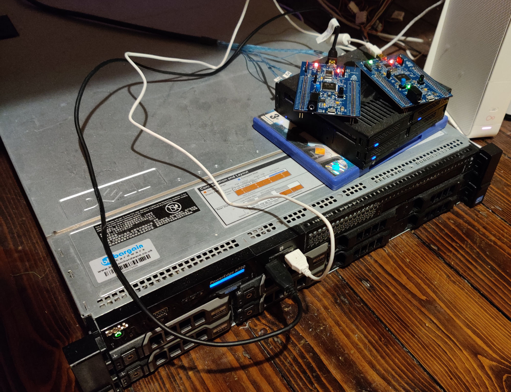

Using the existing SCSS deployment of Submitty was not an option for this
project, for a multitude of reasons, privacy and stability of the system being
top concerns. It was therefore necessary to deploy Submitty itself as the
initial step in the evaluation deployment process. Figure
\ref{fig:deployment_hardware} shows the Dell PowerEdge R720 server that was used
for the test setup, including two boards connected that will later be used for
hardware evaluation. Note that the server is mainly for personal use and is
running a significant number of existing services, which influenced the
deployment methodology.

As alluded to previously, the installation of Submitty demands quite a
specific environment: a Ubuntu 18.04 Server VM [@submitty_installation]. Due to
limited hypervisor capacity on the server, an LXD-based container was used
instead (an existing VM has resources available to allocate to a number of LXD
containers). LXD containers use similar technology to Docker, but aim to replicate
a VM-style system environment [@lxd]. Since an official Ubuntu 18.04 image is
provided by Canonical, there were relatively few additional steps needed to
install Submitty beyond those specified in the documentation.

Once installed, it was possible to create a test course by following the
standard system administrator course creation documentation. At this point, only
a single admin user is being used to test the deployment - anonymous signups
will be needed later.

### Preparing the OS for Perfgrade

In order for Perfgrade to be usable from within Submitty, it was necessary to
install it from scratch. Unfortunately due to the way Submitty performs grading,
with its own dedicated UID's, "isolation" and use of `rlimit`s, it was not
possible to use the Docker image. The installation was done within a Python
virtual environment, which simplifies dependency management and prevents
interference with the system-wide installation of Python [@venv]. gem5 was
compiled on the workstation machine used to develop this project, since its
AMD Ryzen Threadripper CPU cut down the build time significantly. The same LXD
image was used to make sure dependencies would link correctly, and the source
tree was simply copied over.

### Connecting STM32F4 boards

Since the Submitty installation was deployed in an LXD container within a
virtual machine, making the 2 STM32F4 Discovery boards (pictured in figure
\ref{fig:deployment_hardware}) accessible to Perfgrade was a little convoluted.
The virtual machine was QEMU-based, using libvirt for management. Since
QEMU natively supports USB emulation, and libvirt exposes this feature, it was
possible to pass the two boards from the hypervisor OS layer through to the
LXD VM, referencing the devices by their bus locations. Once accessible in the
LXD host, it was possible to "pass through" both boards by their common
`vendor_id:product_id` pair. It was also necessary to set the permissions on the
`/dev/bus/usb` nodes to world-writable so that unprivileged grading processes
could access them.

### Configuring the assignments

Some work was required to configure Submitty to make use of the pipelines
created for automated grading of the three Introduction to Computing II
assignments. This is mainly due to the fact that Submitty's assignment
configuration system is set up to facilitate specific types of assignments in
specific programming languages. Much of this is likely a result of being
developed initially for internal courses only. Regardless, it was possible to
set up a file structure to achieve the desired autograding setup. A
`config.json` file tells the autograding system in Submitty how an assignment
should be graded [@submitty_autograding].

To simplify development, the config file was written in YAML. It was trivial to
then convert this file into the required JSON format for use by Submitty. Each
part of the config file will be explained in this section, within the
context of the `subarray` assignment. The complete definition is located at
`app/examples/subarray/config.yaml`. The other two assignments have very
similar config files in their own directories.

All steps in the autograding process for Submitty use a "`testcase`", whether or
not they are actually testing something. Each of the Perfgrade pipelines
discussed previously have their own `testcase`, which generally has a command
to run and a number of `validation` objects. Validation objects are responsible
for deducting points and producing output in the results section of the web
interface.

``` {.bash label="lst:submitty-bypass" caption="Submitty command filter bypass script"}
#!/bin/sh
exec venv-run --venv /opt/perfgrade -- perfgrade "$@"
```

**Note:** Submitty has a peculiar feature where only certain commands may be
provided for a `testcase`. These must be either on a pre-approved list (which is
hardcoded in a C++ file), or start with `./` (i.e. be paths relative to the
current directory). This is probably something left over from the initial
internal-only version of the system. Because of this, it's not possible to run
a command like `perfgrade` directly. To solve the issue, a simple shell script
(shown in listing \ref{lst:submitty-bypass}) was created. This script simply
executes the `perfgrade` command with the provided arguments. `venv-run` is
used because Perfgrade was installed in a Python virtual environment (so
`perfgrade` would not be on the default `$PATH`).

#### `testcase`: "Assemble and link ARM program"

\hfill

```yaml
type: Compilation
title: Assemble and link ARM program
command: ./perfgrade.sh build.yaml
executable_name: perfgrade.bin
points: 2
validation:
  - method: fileExists
    description: Perfgrade log (stderr)
    actual_file: STDERR.txt
    show_actual: always
    deduction: 0
  - method: fileExists
    description: Make log (stdout)
    actual_file: STDOUT.txt
    show_actual: always
    deduction: 0
```

Corresponds to the "Build" pipeline:

- `type` is set to `Compilation`, which puts this testcase in the "Compilation"
  autograding phase.
- `command` simply executes the Build pipeline.
- `executable_name` identifies the main output of the build step.
- 2 `points` are given for the build passing successfully. If the `command`
  fails, no points will be awarded.
- Two `fileExists` validators are used to show the Perfgrade
  log (which is written to `stderr` that Submitty redirects to `STDERR.txt`) and
  `make` command log (which is written to `stdout`).
  - Setting `show_actual` to `always` means that Submitty will always render
    these files in the web UI, whether or not the `command` succeeded.
  - `deduction` is 0 since the points will be deducted if the `command` fails anyway.

#### `testcase`: "Correctness"

\hfill

```yaml
title: Correctness
command: ./perfgrade.sh correctness.yaml
points: 4
validation:
  - method: custom_validator
    command: cp test02/validation_results.json .
    description: Correctness check
    actual_file: validation_results.json
    show_actual: never
    deduction: 1
  - method: errorIfNotEmpty
    description: Output difference
    actual_file: diff.txt
    show_actual: on_failure
    deduction: 0
```

Executes the Correctness pipeline:

- `type` is unset (defaulting to `Execution`), meaning the testcase runs in the
  "Execution" phase.
- The first validator is of type `custom_validator`, which typically runs a
  command to perform validation in the "Validation" phase. However, to make
  pipeline design easier, the results are generated in the Correctness pipeline
  (as previously explained).
  - The "validation command" just copies the appropriate JSON file.
  - `show_actual` is set to `never` since this file shouldn't be seen by users.
  - `deduction` is set to 1. This is set to 1 and not 4 because Submitty adds
    all of the deduction values up to 1 to determine the proportion of points
    that should be deducted from the title.
- The second validator is `errorIfNotEmpty` on the `diff.txt` file, which will
  be empty if all of the correctness cases matched.
- Not shown here are the same `stderr` and `stdout` "validators" used to show
  the logs from Perfgrade in the web UI.

#### `testcase`: Performance

\hfill

```yaml
title: Performance
command: ./perfgrade.sh performance.yaml
points: 4
validation:
  - method: errorIfEmpty
    description: Statistics
    actual_file: stats.txt
    deduction: 0
  - method: errorIfEmpty
    description: Heatmap
    actual_file: heatmap.pdf
    deduction: 0
  - method: errorIfEmpty
    description: Grade curve
    actual_file: grade.pdf
    deduction: 0
  - method: errorIfEmpty
    description: Performance curve
    actual_file: curve.pdf
    deduction: 0
```

Executes the Performance pipeline, mostly the same as the Correctness
`testcase`. The validators for validation results JSON (for the performance
grade) and Perfgrade logs are not shown. `errorIfEmpty` validators are used to
show the statistics, heatmap, grade curve and performance curve in the web UI.
Note that all of the visualisations are in PDF format, as most other filetypes
will be printed in text form (a hardcoded exception exists for PDF files,
which are embedded as `<iframe>`s).

#### File management

\hfill

```yaml
autograding:
  submission_to_compilation: [subarray.s]

  submission_to_runner: [subarray.s]
  compilation_to_runner: [perfgrade.sh, common.yaml, correctness.yaml, performance.yaml, perfgrade.elf, perfgrade.bin]

  work_to_public: [test03/heatmap.pdf, test03/grade.pdf, test03/curve.pdf]
```

For each phase of autograding, Submitty needs to
know which files should be carried from to the next. While all three phases
("Compilation", "Execution" and "Validation" are technically used, Perfgrade
pipelines are only ever used in the "Compilation" and "Execution" phases.

1. All of the required files (pipelines and associated extras) are placed in the
   `provided_code` directory, which Submitty automatically copies into the
   compilation phase working directory.
2. `subarray.s`, the student's submitted source code, is required in the
  "compilation" phase for the "Build" pipeline, so it is included in the
  `submission_to_compilation` array (in order for Submitty to copy it into the
  appropriate working directory).
3. `subarray.s` is also required for the execution phase (for heatmap
   generation), so it is included in the `submission_to_runner` array.
4. `compilation_to_runner` lists all the files that should be copied from the
   Compilation to Execution phase. Since both the Correctness and Performance
   pipelines run in the Execution phase, this is most of the files.
5. `work_to_public` specifies files that should be copied to the public HTTP
   directory (per-user). This includes all of the PDF's generated. Other files
   are embedded directly in the PHP template generated by Submitty.

#### `rlimit`s

\hfill

```yaml
resource_limits:
  RLIMIT_CPU: 600
  RLIMIT_NPROC: 1000
  RLIMIT_STACK: 10000000
  RLIMIT_DATA: 4000000000
  RLIMIT_FSIZE: 0x8000000
```

Submitty enforces `rlimit`s on all autograding processes. The values above are
quite generous, owing to the fact that gem5 can use quite a lot of CPU and
memory.

### Creating Gradeables

Once all of the autograding configuration for Submitty has been created, it can
be copied to the Submitty server (with `config.yaml` converted to
`config.json`). Following the standard documentation, a "Gradeable" can be
created for each assignment, and the autograding configuration is then assigned
to it. `BUILD_<course>.sh` rebuilds all of the gradeables for the test course.

### Public access and anonymous signup

``` {label="lst:submitty-nginx" caption="Submitty nginx config"}
server {
	listen 443 ssl http2;
	server_name submitty.nul.ie;

	location /signup/ {
		set $backend "http://submitty.lxd.h.nul.ie:8080/";
		proxy_pass $backend;
	}
	location / {
		set $backend "http://submitty.lxd.h.nul.ie";
		proxy_pass $backend;
	}
}
```

In order for students to submit their solutions, the Submitty server must be
publicly accessible over the internet and anonymous signup is needed. Since
Submitty does not natively provide any form of user registration system, a
basic web application was written in Go to facilitate this. Listing
\ref{lst:submitty-nginx} shows the nginx reverse proxy configuration snippet
used to make Submitty accessible over the internet, along with the registration
system. Note that the nginx server used here is used for a number of other
unrelated services and is therefore pre-configured to be accessed over TLS with
appropriate certificates and DNS records. The hostnames for the backends come
from an internal DNS server.

``` {label="lst:submitty-anon" caption="Submitty anonymous signup SQL"}
if _, err := tx.ExecContext(
	ctx,
	`INSERT INTO users (user_id, user_password, user_firstname, user_lastname, user_access_level, user_email, time_zone) VALUES ($1, $2, $3, $4, $5, $6, $7);`,
	info.Username, string(pwHash), "Anonymous", id, s.config.Submitty.AccessLevel, "", "Europe/Dublin",
); err != nil {
	tx.Rollback()
	return info, fmt.Errorf("failed to write user into database: %w", err)
}

if _, err := tx.ExecContext(
	ctx,
	`INSERT INTO courses_users (semester, course, user_id, user_group, registration_section) VALUES ($1, $2, $3, $4, $5);`,
	s.config.Submitty.Semester, s.config.Submitty.Course, info.Username, s.config.Submitty.Group, strconv.Itoa(s.config.Submitty.RegistrationSection),
); err != nil {
	tx.Rollback()
	return info, fmt.Errorf("failed to write user into course database: %w", err)
}
```

The exact details of `submitty-anon`, the Go web application that allows for
anonymous signups, will not be explained here. Listing \ref{lst:submitty-anon}
shows the snippet that makes the necessary insertions into the Submitty
PostgreSQL database. The full source code for this application is available in
the `submitty-anon` subdirectory.

With the above pieces in place, students can visit
[https://submitty.nul.ie/signup/](https://submitty.nul.ie/signup/), where a
brief overview of the project is given.
Upon clicking a button, they will receive a randomly generated username and
password with which to log in and submit assignments.

\newpage

# Results

## Submission interface

The following pages show screenshots of the Submitty assignment submission
interface with Perfgrade integration (for the "2D Arrays" assignment). The
code used for submission was the instructor's solution. These images
essentially summarise the combination of all components implemented for the
project.

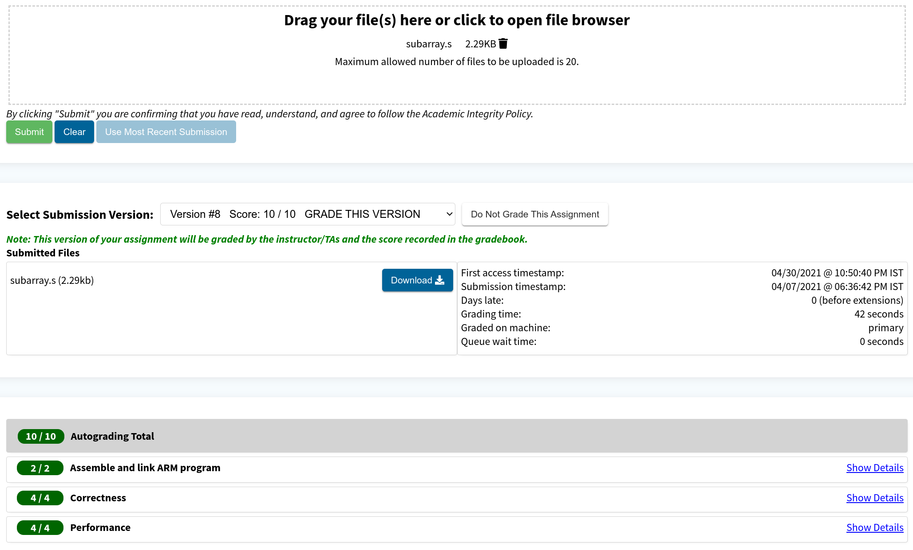

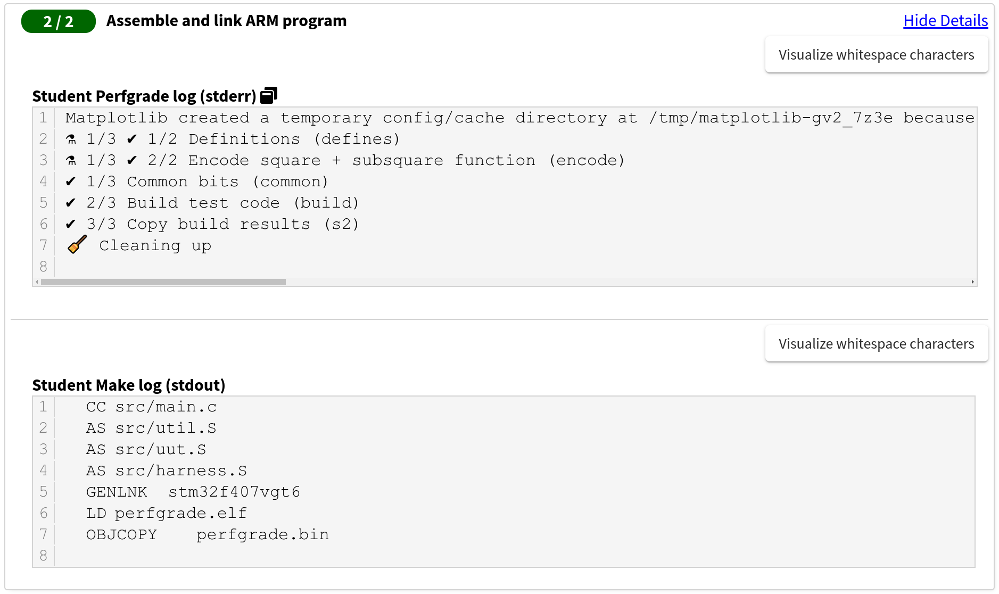

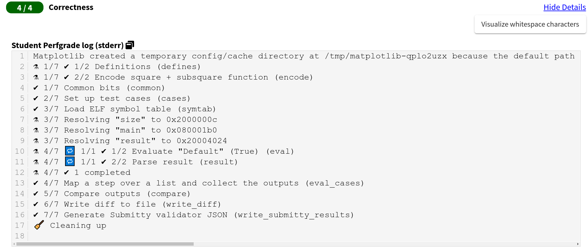

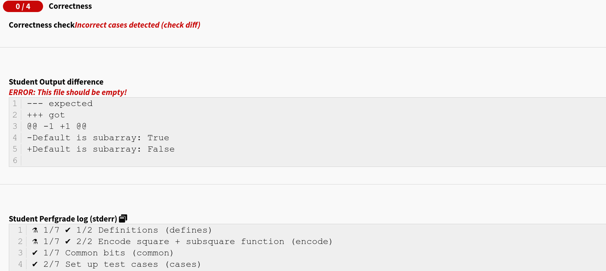

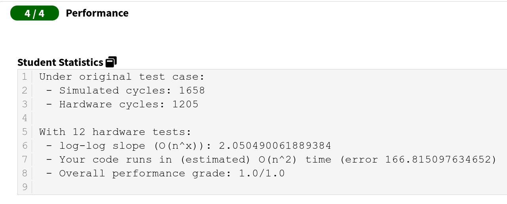

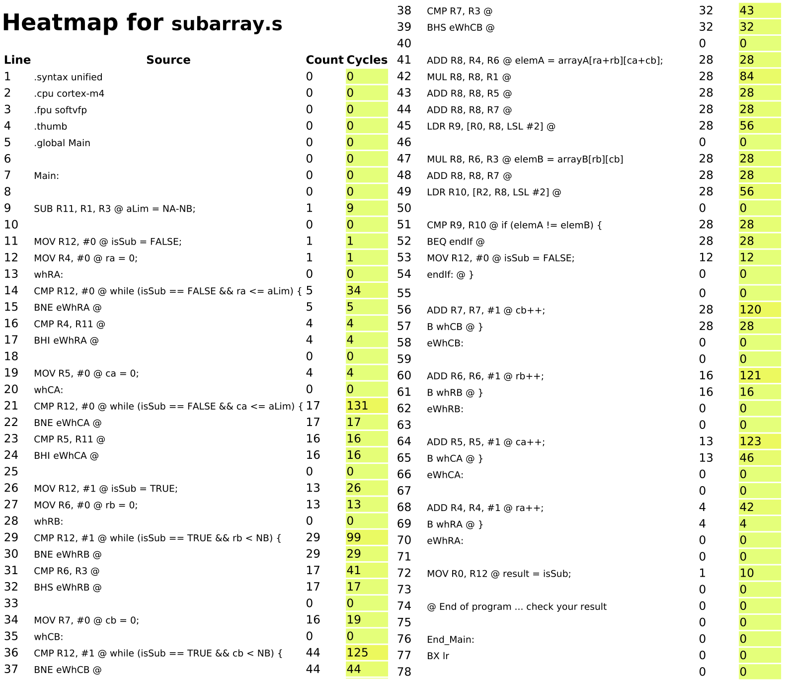

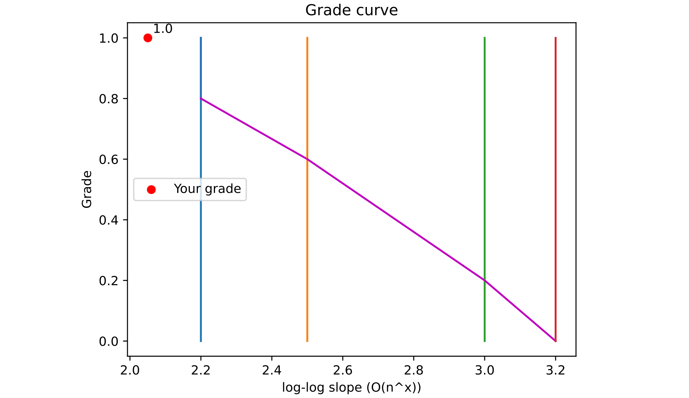

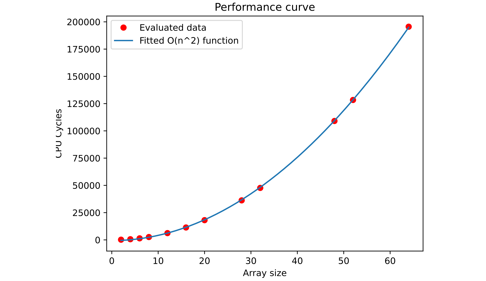

## Student submissions

Following the presentation of the project at an Introduction to Computing
lecture and an email announcement sent to the class:

- About 50 students registered with the Submitty system (approximately 100
  attendees at the lecture). The exact number is difficult to determine since
  all signups are anonymous and a few accounts were used for testing.
- There was an approximate submission rate 55% - 65% for each of the three
  assignments:
    - Arrays: 66.1%
    - 2D Arrays: 58.9%
    - Stacks: 55.4%

For each of the assignments, combined "grade curve" graphs were produced for all
submissions. Note that outliers with log-log values of 0 were excluded, since
these solutions did not execute correctly. Figures
\ref{fig:results_arraymove_all}, \ref{fig:results_subarray_all} and
\ref{fig:results_expressions_all} show these graphs:

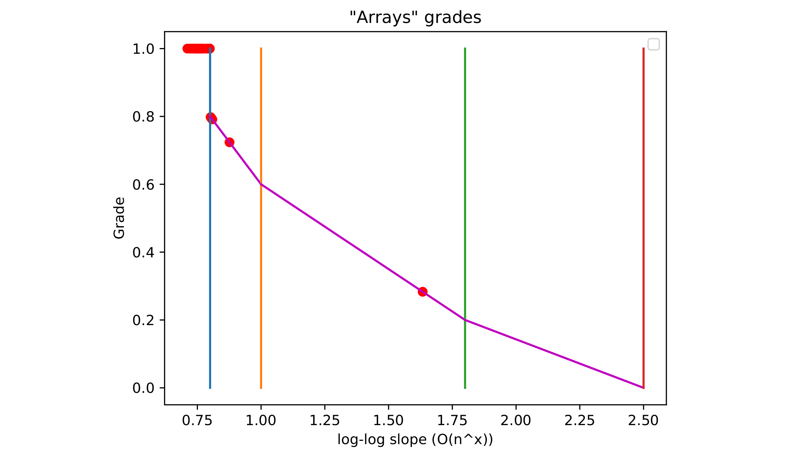

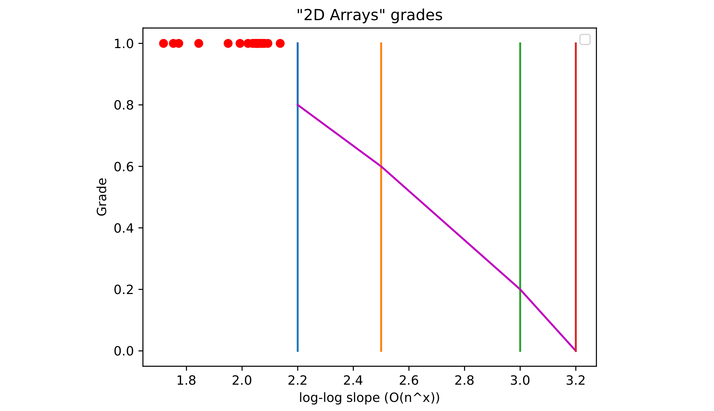

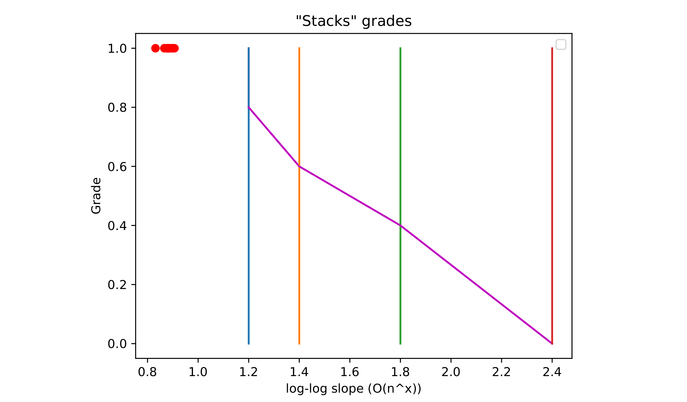

## Survey results

19 responses to the survey featuring 5 Likert scale questions on the
effectiveness of the system were received:

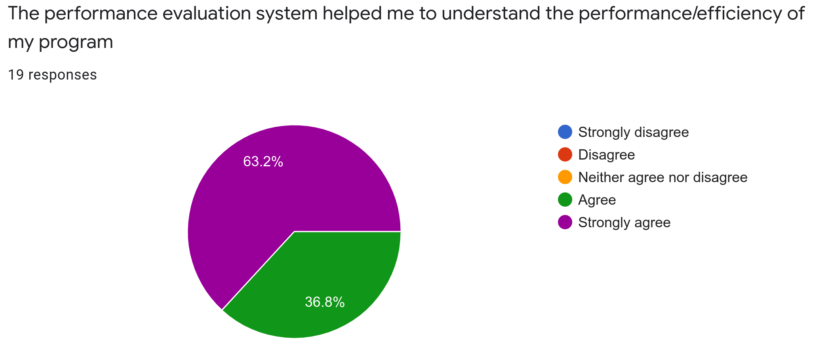
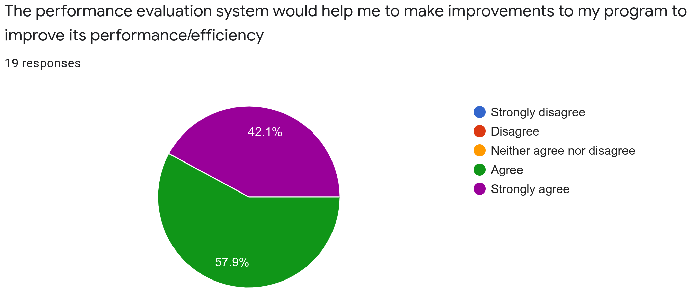
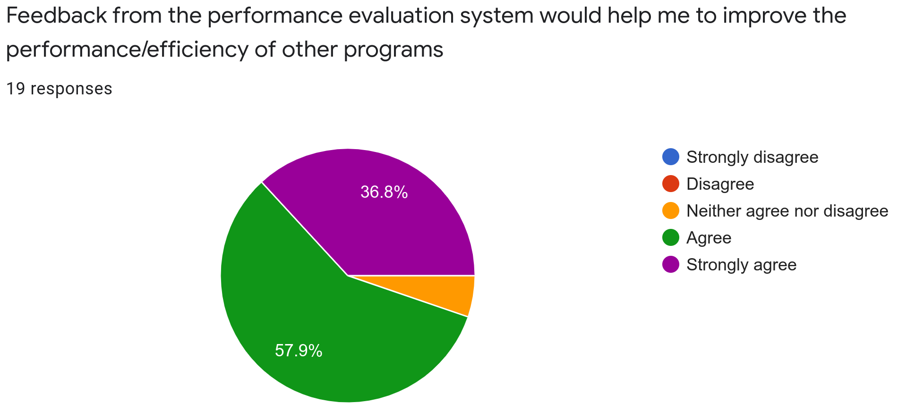
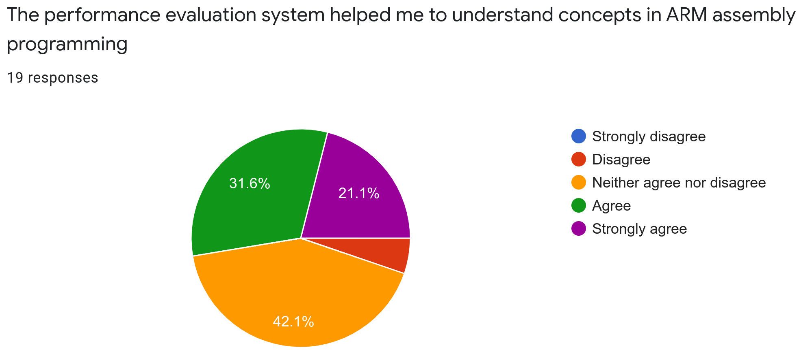
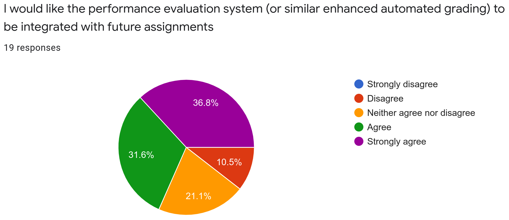

\newpage

# Discussion and conclusion

\newpage

# References
