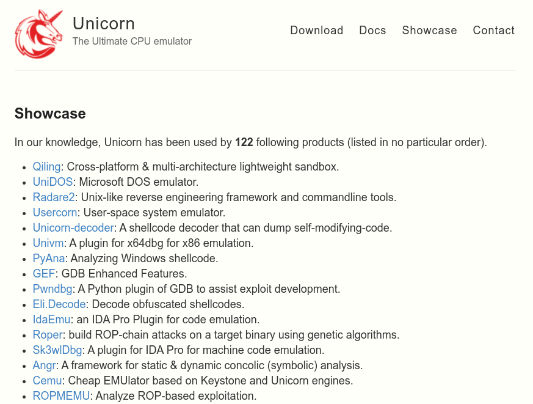
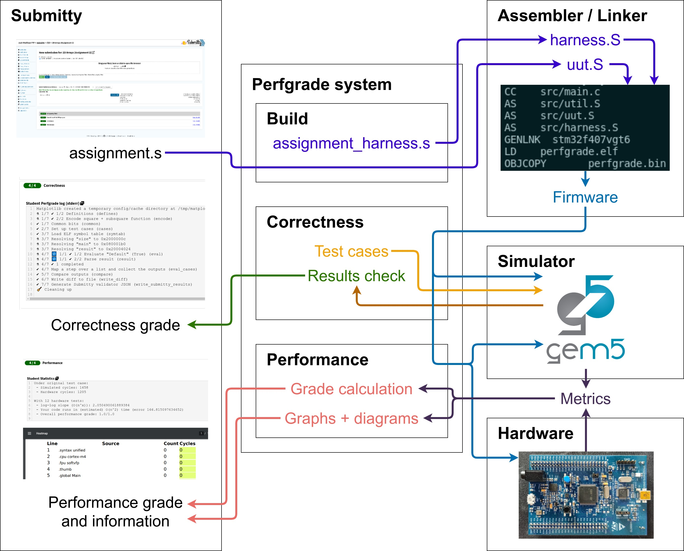

# Introduction

## Motivation

Automated grading of programming assignments is a desirable option to have,
allowing instructors and teaching assistants to save a significant amount of
time. Since programming assignments are often based
upon the implementation of a solution to a single fairly specific problem, they
seem like a fairly obvious candidate for automation.

The focus when performing automated
grading is almost always on functional or "black box" testing. In
this model, a student's code is given a set of inputs, and the produced outputs
are tested against a corresponding pre-determined set of correct ones [@online_judge].
This is usually as simple as passing a list of items as command line arguments
or strings on standard input and parsing the results from standard output.
Often, an additional set of "hidden test cases" (inputs which the student can
never obtain direct access to) is used to prevent hardcoding of answers [@online_judge].

Aside from checking for hardcoded outputs, the quality of a submission is
rarely tested. While this is less important for
some types of assignments (perhaps implementation of an algorithm in a high-level
language), marks for topics like high-performance assembly programming are
often given for specific instructions and optimisations used.

In order to more appropriately grade assignments in such topics, more
in-depth analysis is required. Usually this comes in the form of a manual marking
step. Here (in the case of an assembly language assignment), a grader might
review a student's submission and identify
specific issues, such as the use of extraneous CPU instructions or poor overall
program structure.

The mechanism through which this analysis might be automated is much less
obvious, but any reduction in the requirement for manual grading would be very
beneficial.

In addition to the benefits for instructors, students can also take advantage of
an automated grading system. With manual grading, there is a significant delay
between submission and receiving feedback for an assignment. Since
an automated system can perform its grading in a matter of minutes or seconds,
students can learn more efficiently. They might be able to improve a single
assignment before final submission or simply be prepared for future assignments
more quickly.

\newpage

## Goals

This project seeks to develop an automated grading system which focuses
specifically on measuring performance (at runtime) of ARM assembly language
programs. As previously mentioned, there are a number of potential aspects for
improving automation around programming assignment grading. By choosing a
specific type of assignment and domain for improvement, a more in-depth system
can be realised.

Since the type of assignments being analysed will be relatively short,
hand-written ARM assembly language programs, it makes sense to look at
performance. This is primarily due to the fact that assembly language programs
are usually written with high-performance in mind. Additionally, other aspects
of a program's
grading (aside from correctness) such as maintainability are somewhat more
difficult to anaylse, given that assembly programs have very little structure.
Dynamic or runtime performance analysis is also used over static analysis for
the same reason.

The final product will be designed to facilitate grading assignments in the
modules "Introduction to Computing" (parts I and II), taught to first year
computer science students. This will include testing against specific
assignments given in the modules. The system will also need to integrate with
Submitty, the online grading platform already used in the module. It's worth
noting that the Introduction to Computing modules focus on writing programs to
run on an ARM-based microcontroller. At time of writing, this is specifically an
STMicroelectronics STM32F4xx-based board (featuring an ARM Cortex-M4 core).
This project will target the same platform.

\newpage

# Background

## Prior work

## Hardware

ARM processors are pervasive in mobile devices and increasingly so in
microcontrollers, displacing 8 bit products. Newer designs in the Cortex-M
series feature increasingly
complex cores with more features than the older ARM7 and ARM9.

STMicroelectronics produce a series of microcontrollers (and accompanying
low-cost development boards) making use of Cortex-M cores called "STM32". The
STM32F4xx series is based upon a Cortex-M4, which in turn is effectively a
Cortex-M3 with floating point and DSP instructions [@cortex_m4]. These cores
implement the ARMv7-M architecture, which use only the Thumb-1 and Thumb-2
instruction sets [@armv7m].

The STM32F4 Discovery board is the target board for Introduction to Computing
(and is therefore also the target for this project). Figure
\ref{fig:stm32f4_discovery} shows the board featuring an STM32F407VG
microcontroller and an integrated ST-LINK/V2 debugger [@stm32f4_discovery]. The
ST-LINK is a standard debugging component provided by ST that implements ARM's
Serial Wire Debug (SWD) protocol, which requires only 2 pins - SWDIO and SWCLK
[@arm_swd].

The STM32F407VG provides a wide range of peripherals - the reference manual
describing them is over 1700 pages long [@stm32f407]. Use of peripherals is
relatively limited in Introduction to Computing, with only the standard ARM
SysTick timer and GPIO's being used.

## Emulators and simulators

Emulators and simulators are useful tools that can be used, in whole or part, to
replace a piece of real hardware.
In general, an *emulator*
attempts to achieve full functionality of a real system, usually maximising
performance by designing the system with the host in mind. A *simulator* aims
to accurately model the internals of a system and is generally less of a
replacement for real hardware. Some tools combine both, using accurate
simulation only for the most critical sections of evaluation [@marss].

A number of both emulators and simulators were considered for the "software" method
of evaluating programs for this project. It wasn't immeditately clear which
would best fulfill the needs of the project, as they each have benefits and
drawbacks.

### xPack QEMU

QEMU (the Quick EMUlator) describes itself as "a generic and open source
machine emulator and virtualizer" [@qemu]. It's purpose is generally to emulate
full systems, including peripherals such as hard drives and network interfaces.
Typically, hardware accelerated virtualisation technology is used to achieve
near-native performance (e.g. KVM on Linux). QEMU also offers the ability to
emulate software compiled for other CPU's with user-mode syscall translation.
It's very flexible, but is most importantly focused on achieving maximum
performance, with the website's tagline as
"QEMU: the FAST! processor emulator" [@qemu].

The xPack project provides "tools to manage, configure and build complex,
package based, multi-target projects" [@xpack]. xPack's primary goal is to
provide a dependency management tool for embedded projects (primarily
toolchains, with a particular focus on ARM).

A subproject of xPack is their
fork of QEMU, referred to as "The xPack QEMU Arm". This fork of QEMU seeks to
address the lack of support for microcontroller cores in QEMU (which generally
emulates high-performance application cores only). Specifically, the fork aims
to support Cortex-M3 and M4 boards (including peripherals). The STM32F4 Discovery
development board (featuring an STM32F407 chip), used in Introduction to
Computing, is one of the supported boards. Emulation is quite
detailed, and a graphical representation of the board with LED's that react
to changing GPIO state is provided (see Figure \ref{fig:xpack_qemu_gui}).

Aside from better Cortex-M peripheral support, xPack QEMU doesn't really
provide any features over upstream QEMU (instrumentation, improved accuracy
etc). xPack's QEMU is currently used in Introduction to Computing (particularly
for its GUI mode, allowing for GPIO demonstrations without needing real
hardware).

### Unicorn

Unicorn describes itself as a "CPU emulator framework" [@unicorn]. Based on
QEMU, Unicorn seeks to provide a framework for emulating and instrumentating
code across many architectures. A key difference between Unicorn and xPack QEMU
(or even upstream QEMU) is its narrower focus: no peripherals are supported at
all. Unicorn only emulates raw machine code.

Being developed with security research in mind (and initially presented at Black
Hat!), Unicorn exposes an easy to use API allowing for powerful instrumentation.
This is a notable extension over QEMU, which provides no such access. The
emulated CPU can be programmatically hooked (with bindings in a multitude of
popular programming languages) to control execution and inspect
registers and memory on a per-instruction basis [@unicorn]. It's not possible
to record accurate timing information or break down execution to a level beyond
a single instruction however (an inherent limitation when using QEMU as a base).

Since Unicorn has seen a lot of use in information security research (see figure
\ref{fig:unicorn_showcase}), it is relatively well documented and easy to use
(although there is little to no official documentation beyond examples given
in the original Black Hat talk).

### gem5

gem5 is vastly different to both xPack QEMU and Unicorn. With its primary goal
of "\[being\] a community tool focused on architectural modeling" [@gem5],
gem5's design and features are unrelated to those of QEMU and the forks
described previously. gem5's headline feature is really its flexibility and
modularity (it's the first goal listed in the project's original paper), which
originally comes from M5 (a previous simulator folded into gem5).

The simulator's flexibility primarily stems from its tight, object-oriented
integration with Python. All components in gem5 are `SimObject`s. These contain
two pieces: a C++ implementation and a Python binding. While the C++
part implements the behaviour of the component (e.g. a memory controller) for
high performance, the Python part defines the parameters for the component
[@gem5]. An overall Python-based configuration script instantiates all of the
`SimObject`s and wires them up. "Ports" are generally used to connect
communication between components such as memories. A visualisation of such a
configuration script (generated by gem5 itself) can be seen in figure
\ref{fig:gem5_config_complex}.

Using this modular design, it's possible to create a nearly endlessly
customisable system layout based on the requirements of a particular
application. gem5 can simulate a number of different CPU ISA's and memory
systems with various models. For CPU's, it's possible to simulate certain
segments of code in a simple "atomic" mode (for performance) and critical
segments using a complex pipelined and out-of-order execution model named "O3"
(for detailed analysis). Memory can also be modelled as simple SRAM-style
hardware with a fixed latency, or complex DRAM.

gem5 also supports two primary execution modes, similar to QEMU. In full system
mode ("FS"), gem5 emulates a full bare-metal system, with interrupts and
peripheral support (sophisticated enough to boot a full Linux kernel). Syscall
emulation mode ("SE") emulates syscalls for executing user-mode programs.

Adding and making use of new features (as `SimObject`s) is easy with gem5's
SCons-based build system and Python-based configuration scripts.

\newpage

# Design

There are a number of components required to produce a functioning automated
grading system for measuring performance of ARM assembly language programs.
Collectively, these are referred to as "**_Perfgrade_**". This section describes
the high-level design of the system.

## Considerations

Before a final overall system can be realised, there are a number of factors to
consider when designing _Perfgrade_.

### Metrics

Metrics are the types of raw data that can be collected in order to later
generate useful information. It's important to keep in mind the types of
metrics that can or need be collected - what metrics can be collected from a
particular system and which are required to generate specific results.

When measuring performance, the simplest metric to
consider is a measure of execution time. The most basic form of such a metric is
to run a timer or "stopwatch" while a program is running. A more precise and
reliable method will be required to measure time for the types of short assembly
programs graded by the system.

Aside from measuring execution time, this project will likely make use of another
somewhat broad "metric" in _tracing_. Tracing a program involves logging in
detail each execution of small blocks in a program, often as small as a single
instruction [@profiling_tracing]. This provides a lot of data that could
potentially be used to measure performance. In its simplest form, a trace might
contain a sequential list of memory addresses, each being the value of the
program counter every time the CPU executed an instruction. With the original
program, it would be possible to reconstruct the exact path the processor took.

### Execution and measurement methods

There are two overall methods for executing programs and
recording some of the metrics described above
(within the context of this project): Hardware and software. **Hardware** refers
to the evaluation of a program on a real STM32F4xx-based microcontroller.
**Software** means evaluation of a program in some kind of emulator or simulator
that itself runs on a standard PC or server.

Which "method" is best for this project is not entirely clear, as both carry
their own advantages and disadvantages.

Software:

- is generally easy to set up and deploy, from a laptop to a server environment
- can usually be extended (e.g. to improve accuracy or measurement capabilities)
- may be lacking in accuracy (popular emulators don't often implement the
  concept of CPU cycles)
- can be slow (especially if high accuracy is required)

Hardware:

- is perfectly accurate
- requires additional physical components for deployment (less flexible)
- may require complex software infrastructure to manage
- isn't possible to extend
- may be difficult or impossible to measure metrics in detail

### Assignment configuration

Due to the nature of the assignments being graded, consideration needs to be
made for how to set up each assignment in the system. Not every problem can be
graded with the same parameters: there will be specific test cases and
potentially different sections of a program that should be measured. A flexible
configuration system is therefore required to fulfill these requirements.

Since the system needs to integrate with Submitty, assignment configuration
will need the ability to generate the output required to publish results in
the appropriate format. In addition, the system would ideally be flexible
enough to support another grading platform in future, if needed.

### Grading results

Once execution and collection of metrics through the assignment configuration
system is completed, there should be two outputs: the performance grade and
additional "informational results". That is, how well the submission performed
represented as a score and other (arbitrary) information that doesn't directly
contribute to the score value.

The most important aspect of this is how to calculate the performance grade or
score. Given the types of metrics that might be collected, how can a number on
a scale be generated? A cycle count gives a sort of "absolute" measure of how
well a program performs, but this will need to be placed on a relative scale.
It's also worth considering that the relationship between a cycle count and the
scale may not be simple. An algorithm that runs in $O(n^2)$ time may not be
that much worse than program running on $O(n)$ in the case of a particular
assignment.

Any additional outputs that don't factor in to the performance grade need only
be considered based on their usefulness to both instructors or students. Graphs
or diagrams might help to show why a submission received a particular grade.

## High-level components

The diagram above shows the primary components in the Perfgrade system, along
with high-level interactions.

### Submitty

This is the primary driver of the system, along with the only way students can
interact with Perfgrade. Typically for Introduction to Computing, a student will
log in to the interface with their college credentials, select an assignment and
upload a single ARM assembly language source file as their submission. At this
point Submitty hands the source over to Perfgrade, which handles producing the
grades and other outputs shown to the student.

### Perfgrade system

The main "glue" in this project, facilitating assignment configuration. As shown
in the diagram, the student's submission is taken as an input, which is passed
to other components. Outputs from these are used to produce the results required
by Submitty. Note the distinct steps which are individually used in Submitty.

Additionally, it can be seen in the diagram that the system makes use of both
a simulator ("software") and hardware. Both of these options are _almost_
interchangeable in terms of functionality (as will be discussed later).

### Assembler / Linker

A build process making use of an open-source toolchain (where a submission is
assembled and linked to some additional code) to produce a working
firmware for evaluation of a student's program.

### Simulator

The "software" option for evaluation is used to check correctness of a
submission, loading test cases and writing out the results. It's also used in
part to evaluate performance.

### Hardware

A real STM32F4xx-based board is used to evaluate performance of the solution.

## Evaluation environment choice

\definecolor{excellent}{RGB}{100,143,255}
\definecolor{good}{RGB}{254,97,0}
\definecolor{poor}{RGB}{220,38,127}

**Tool** | **Accuracy** | **Performance** | **Compatibility** | **Instrumentation** | **Difficulty**
 ---:|:--- |:--- |:--- |:--- |:---
xPack QEMU | \textcolor{poor}{Low} | \textcolor{good}{Medium} | \textcolor{good}{Medium} | \textcolor{poor}{Low} | \textcolor{excellent}{Low}
Unicorn | \textcolor{poor}{Low} | \textcolor{good}{Medium} | \textcolor{poor}{Low} | \textcolor{good}{Medium} | \textcolor{excellent}{Low}
gem5 | \textcolor{good}{Medium / High*} | \textcolor{poor}{Low} | \textcolor{poor}{Low / Medium*} | \textcolor{excellent}{High} | \textcolor{good}{Medium / High*}
Hardware | \textcolor{excellent}{High} | \textcolor{excellent}{High} | \textcolor{excellent}{High} | \textcolor{good}{Medium / High*} | \textcolor{poor}{High}

The table above shows a comparison of each of the simulators considered for
this project, along with real hardware. As discussed in the background section,
both xPack QEMU and Unicorn are based on QEMU, so they are quite similar.

#### Accuracy

Neither of the QEMU-based emulators are very accurate, given that QEMU is
designed for high performance. In fact, QEMU uses dynamic instruction
translation to maximise speed, which makes the emulation nothing like the real
processor being emulated [@qemu_tcg]. gem5 is much more accurate out of the box,
since it is designed to model complex ARM application cores (Cortex-A series).
It is given a more ambiguous rating since there aren't any configurations for
Cortex-M cores provided, but this should be possible to improve with some work.

#### Performance

Both xPack QEMU and Unicorn therefore have
reasonable performance, although not approaching real ARM hardware of course.
gem5 is a slower since it tries to accurately model complex architectures (when
configured to do so at least).

#### Compatibility

Unicorn has very poor compatbility with firmware built to run on an STM32F407,
given that it only is designed purely to execute pure instructions. xPack QEMU
is better in this regard, since it aims to emulate real microcontrollers and
boards. gem5's compatbility out of the box is also relatively poor, again due to
the lack of pre-made configurations for Cortex-M platforms (along with a lack of
associated peripheral implementations). With further work, compatibility could
be greatly improved.

#### Instrumentation

QEMU provides no support for instrumentation at all, and this extends to xPack's
fork. Unicorn provides a simple to use API, but it doesn't allow for analysis
beyond granularity of a single instruction. gem5 is set up to collect a lot of
statistics throughout execution (since that's effectively what it was designed
for). It also has the ability to generate very detailed trace data and can be
easily extended to add further instrumentation. ARM defines a number of
standardised debugging tools, which can (in theory) provide a lot of
opportunities for analysis. Their use depends on the implementation being present on
a specific microcontroller however, and can in some cases require additional
expensive hardware.

#### Difficulty

Both QEMU-based emulators are very easy to use, with QEMU and Unicorn being
widely used in the open-source community. gem5 is far less common (and has very
limited documentation). The amount of work required to bring gem5's accuracy
and compatibility closer to real hardware could also be substantial. Setting up
some of the more advanced debugging facilities on a real STM32F407 is also
quite complex.

Overall, *gem5 is really the only choice for a software option*, since neither
xPack QEMU or Unicorn provide any sort of cycle accurate modelling. This is
important for the purposes of the project, since the programs being analysed are
short, hand-written assembly programs. Since real STM32F4-based hardware has
inherently perfect accuracy and compatibility, high performance and the
potential for a lot of instrumentation, it's worth exploring this avenue in
addition to gem5.

## Metrics

Given the final choice of evaluation environments, the limits on the types of
metrics that can be collected are set. There are two primary types:
**Execution time** and **Tracing**.

### Execution time

A measurement as crude as a stopwatch can be used to directly compare the
performance of one program
to another. If a program takes longer to execute than another, it stands to
reason that it performs worse.
Using some kind of timer to measure execution time doesn't make a lot of sense
in the context of small, hand-written assembly programs. This is often referred
to as "real time" or "wall-clock time" [@wall_time].

CPU cycle counts would be a more precise measure of execution time, as the
(generally) smallest unit of time a programmer can directly control. Although
CPU features such as pipelining mean that execution of a single instruction does
not directly correspond to a fixed number of CPU cycles, the there's a close
association. The opportunity for variance or errors to arise when measuring
performance using wall time would also increase through the use of operating
systems and preemptive multitasking. When another task or process needs to
execute, real time would continue to count up while the code being measured is
not even running.

### Tracing

Tracing a program involves logging in
detail each execution of small blocks in a program, often as small as a single
instruction [@profiling_tracing]. This provides a lot of data that could
potentially be used to measure performance. In its simplest form, a trace might
contain a sequential list of memory addresses, each being the value of the
program counter every time the CPU executed an instruction. With the original
program, it would be possible to reconstruct the exact path the processor took.

Additional data might be included for each instruction traced, such as the value
of registers involved in the instruction (the "operands"), or the addresses and
values of memory accessed (so-called "data tracing"). In rare cases, code
executed might even by dynamically generated, so it may be necessary to include
the value of the instruction itself in the trace.

Considering the speed of modern processors (and even microcontrollers, including
the STM32F4xx-based chip used in this project), tracing can often generate a
significant amount of data. As such, a simplified statisical method is often
employed when profiling programs. In an example setup, a profiling tool might
sample the value of the processor's program counter at an interval. This results
in a much smaller volume of data, but won't affect accuracy too much in the case
of a long-running execution of a program at high speed.
Profiling is a more broad term for recording
and dynamically analysing execution of blocks of code [@profiling_tracing].

For the purposes of this project, detailed tracing of individual instructions
makes the most sense, given that the programs being evaluated are hand-written
in assembly and relatively short.

## Assignment configuration

## Grade calculation

## Informational results

\newpage

# Implementation

## gem5 setup

## Hardware setup

## Unified firmware

## Perfgrade platform

\newpage

# Evaluation

\newpage

# Results and conclusions

\newpage

# References
